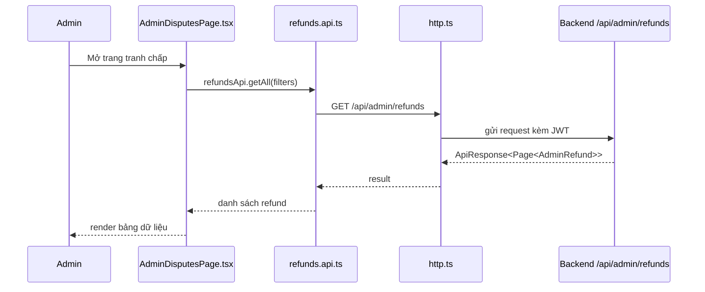
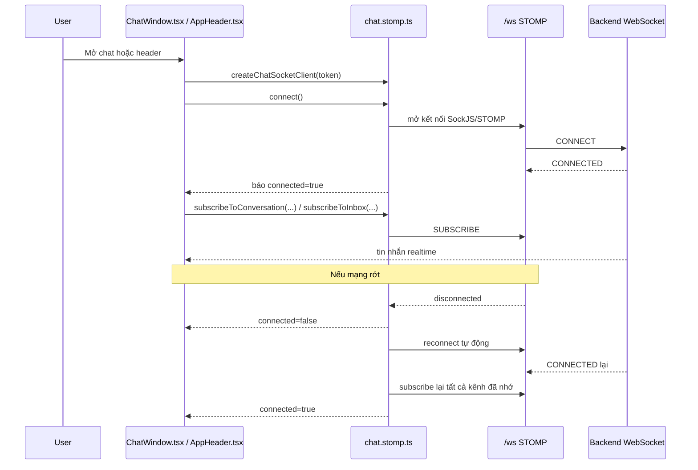

# Admin Refund Review Và Chat Reconnect Basics - 2026-03-18

## Bối cảnh

Trong FE của dự án này, Dev 1 đang phụ trách các phần khó hơn:

- order / payment / refund
- chat realtime
- các màn admin liên quan tới giao dịch

Trước thay đổi này có 2 điểm còn dang dở:

1. `AdminDisputesPage` vẫn dùng dữ liệu giả.
2. Chat realtime có thể tự reconnect ở mức thư viện STOMP, nhưng code FE chưa tự đăng ký lại các kênh chat sau khi reconnect.

## Một số khái niệm cần hiểu trước

### Refund

`Refund` là yêu cầu hoàn tiền.

Ví dụ:

- buyer đã đặt cọc
- sau đó phát hiện xe có vấn đề
- buyer gửi yêu cầu hoàn tiền
- admin xem xét rồi quyết định duyệt hoặc từ chối

### Admin dispute page

Đây là màn hình admin dùng để xem các yêu cầu tranh chấp hoặc hoàn tiền.

Trong dự án này, trang đó là:

- `src/pages/admin/AdminDisputesPage.tsx`

### Realtime

`Realtime` nghĩa là dữ liệu cập nhật gần như ngay lập tức, không cần người dùng bấm refresh.

Ví dụ:

- người bán gửi tin nhắn
- người mua đang mở màn chat
- tin nhắn xuất hiện gần như ngay lập tức

### Reconnect

`Reconnect` là kết nối lại sau khi socket bị ngắt.

Ví dụ:

- mạng chập chờn
- WebSocket bị rớt
- app tự nối lại mà người dùng không cần tải lại trang

### Resubscribe

`Resubscribe` là đăng ký lại các kênh dữ liệu sau khi đã reconnect.

Đây là điểm rất hay bị quên.

Ví dụ:

- trước đó FE đã subscribe vào `/topic/conversation/123`
- socket bị rớt rồi reconnect
- nếu không subscribe lại, FE sẽ không nhận tin nhắn mới nữa

## Phần 1: Admin refund review dùng API thật như thế nào?

### Luồng file trong FE

### Các file chính

- `src/pages/admin/AdminDisputesPage.tsx`
- `src/api/refunds.api.ts`
- `src/types/refund.ts`
- `src/lib/http.ts`

### FE làm gì?

Trang `AdminDisputesPage.tsx`:

- gọi `refundsApi.getAll(...)`
- truyền filter `keyword`, `status`, `page`, `size`
- nhận dữ liệu phân trang từ backend
- render ra bảng
- cho phép admin:
  - xem chi tiết
  - duyệt hoàn tiền
  - từ chối yêu cầu
  - xác nhận đã hoàn tiền

### Vì sao phải tách `api` và `types`?

#### `types`

`types` là nơi mô tả “hình dáng dữ liệu”.

Ví dụ:

- `AdminRefund`
- `RefundStatus`
- `AdminRefundFilters`

Nhờ vậy component biết chắc:

- field nào có tồn tại
- field nào có thể `null`
- status nào hợp lệ

#### `api`

`api` là nơi gom lời gọi HTTP.

Ví dụ:

- `refundsApi.getAll(...)`
- `refundsApi.review(...)`

Ưu điểm:

- page không phải tự viết URL lặp đi lặp lại
- dễ sửa khi backend đổi endpoint

## Phần 2: Chat reconnect hoạt động như thế nào?

### Luồng file trong FE

### Các file chính

- `src/sockets/chat.stomp.ts`
- `src/components/messages/ChatWindow.tsx`
- `src/layouts/AppHeader.tsx`

### Trước đây bị thiếu gì?

Thư viện `@stomp/stompjs` có thể tự reconnect ở mức kết nối.

Nhưng nếu code của mình chỉ subscribe một lần lúc đầu, thì sau reconnect:

- socket nối lại thật
- nhưng kênh chat cũ không tự đăng ký lại

Kết quả:

- người dùng tưởng chat đang hoạt động
- nhưng thực tế không nhận được tin nhắn mới

### Cách sửa trong dự án

Ở `chat.stomp.ts`, code mới:

1. lưu lại danh sách subscription mong muốn
2. khi `onConnect` chạy lại, tự subscribe lại toàn bộ
3. phát sự kiện trạng thái kết nối cho component qua `addConnectionListener(...)`

Ở `ChatWindow.tsx`, component:

1. lắng nghe `connected / disconnected`
2. khi mất kết nối thì báo cho người dùng biết
3. khi kết nối lại thì bật lại ô nhập tin nhắn

## Ví dụ rất đời thường

Hãy tưởng tượng em đăng ký nhận thư ở một bưu cục.

- `connect` = em tới bưu cục và mở tài khoản
- `subscribe` = em đăng ký nhận thư ở quầy số 3
- `disconnect` = em bị mất kết nối, phải rời quầy
- `reconnect` = em quay lại bưu cục
- `resubscribe` = em phải đăng ký lại quầy số 3, nếu không sẽ không có thư gửi đến em nữa

Chat realtime cũng gần giống như vậy.

## Vì sao thay đổi này quan trọng?

### Với admin refund page

- admin không còn nhìn dữ liệu giả
- FE bám đúng API thật của backend
- dễ tích hợp và kiểm thử hơn

### Với chat realtime

- giảm lỗi “chat đang mở nhưng không nhận được tin nhắn”
- trạng thái kết nối rõ ràng hơn
- trải nghiệm người dùng ổn định hơn khi mạng chập chờn

## Những hiểu lầm thường gặp

### Hiểu lầm 1: “Reconnect rồi thì tự nhiên mọi thứ sẽ chạy lại”

Không đúng.

Reconnect chỉ là nối lại đường dây.

Nếu em không `resubscribe`, em vẫn không nhận được dữ liệu mình cần.

### Hiểu lầm 2: “Page nào cần chat thì tự xử lý socket riêng”

Làm vậy rất dễ bị trùng logic, khó sửa, và khó debug.

Trong dự án này nên gom logic socket chung vào:

- `src/sockets/chat.stomp.ts`

### Hiểu lầm 3: “Admin page chỉ cần render bảng là đủ”

Không đủ.

Admin page còn cần:

- filter
- xem chi tiết
- hành động review đúng theo trạng thái
- hiển thị lỗi khi API fail

## Tóm tắt ngắn

- `AdminDisputesPage.tsx` giờ đã dùng API thật thay vì mock.
- `refunds.api.ts` là nơi gọi backend cho admin refund list và review.
- `chat.stomp.ts` giờ nhớ các subscription và tự subscribe lại sau reconnect.
- `ChatWindow.tsx` phản ứng đúng hơn với trạng thái realtime.

Nếu đọc code theo luồng, nên đi theo thứ tự này:

1. `src/types/refund.ts`
2. `src/api/refunds.api.ts`
3. `src/pages/admin/AdminDisputesPage.tsx`
4. `src/sockets/chat.stomp.ts`
5. `src/components/messages/ChatWindow.tsx`
