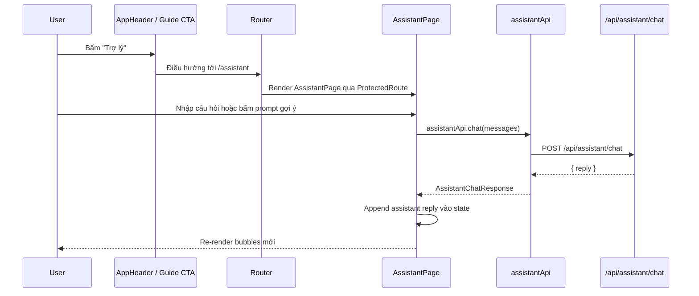

# Assistant page, route và chat UI basics - 2026-03-24

## 1. Mục tiêu của slice FE này là gì?

Frontend cần một nơi để user hỏi trợ lý AI về trạng thái thật của tài khoản.

Slice này làm 3 việc:

- thêm route bảo vệ `/assistant`
- thêm entry ở header để user mở nhanh
- thêm trang chat UI gửi hội thoại lên backend rồi render câu trả lời

Slice đầu **chưa lưu hội thoại vào database**. Mọi thứ đang là local state trên trang.

## 2. Luồng FE chạy như thế nào?

## 3. File nào chịu trách nhiệm gì?

### Route

- [routes.ts](/e:/Old_bicycle_system/old-bicycles-project/fe/src/constants/routes.ts)
- [index.tsx](/e:/Old_bicycle_system/old-bicycles-project/fe/src/router/index.tsx)

`ROUTES.ASSISTANT` được thêm vào và route này nằm sau `ProtectedRoute`, nên user chưa login sẽ bị chuyển sang trang login.

### Header navigation

- [app-header-visibility.ts](/e:/Old_bicycle_system/old-bicycles-project/fe/src/layouts/app-header-visibility.ts)

Logic hiện tại:

- guest: không thấy `Trợ lý`
- user đã đăng nhập: thấy `Trợ lý`

Điều này hợp lý vì assistant mức 2 cần context thật của tài khoản.

### API module

- [assistant.api.ts](/e:/Old_bicycle_system/old-bicycles-project/fe/src/api/assistant.api.ts)
- [assistant.ts](/e:/Old_bicycle_system/old-bicycles-project/fe/src/types/assistant.ts)

Frontend chỉ gọi một API:

- `POST /api/assistant/chat`

Payload đơn giản:

- `messages[]`

Response đơn giản:

- `reply`

### Page UI

- [AssistantPage.tsx](/e:/Old_bicycle_system/old-bicycles-project/fe/src/pages/AssistantPage.tsx)

Trang này dùng:

- local state để giữ message bubbles
- suggestion buttons theo role
- textarea để nhập câu hỏi
- loading state và error state rõ ràng

## 4. Suggestion theo role để làm gì?

User mới mở assistant thường chưa biết nên hỏi gì.

Vì vậy FE thêm vài câu hỏi mẫu theo role:

- buyer
- seller
- inspector
- admin

Nhờ vậy user có thể bấm một lần là ra được câu trả lời có context, thay vì phải nghĩ prompt từ đầu.

## 5. Vì sao route này phải là protected route?

Nếu route này public:

- backend sẽ không biết context của ai
- chatbot chỉ còn như FAQ chung
- mất đúng ý nghĩa “mức 2”

Protected route giữ cho slice này đúng mục tiêu:

- assistant trả lời theo account thật đang đăng nhập

## 6. State trong AssistantPage hoạt động ra sao?

Trang có 4 state chính:

- `messages`
- `draft`
- `isSubmitting`
- `error`

Luồng rất đơn giản:

1. user gõ câu hỏi
2. FE append user message vào `messages`
3. FE gọi API
4. nếu thành công:
   - append assistant reply
5. nếu thất bại:
   - hiện error banner

## 7. Test FE kiểm tra gì?

File test:

- [AssistantPage.test.tsx](/e:/Old_bicycle_system/old-bicycles-project/fe/src/pages/AssistantPage.test.tsx)
- [app-header-visibility.test.ts](/e:/Old_bicycle_system/old-bicycles-project/fe/src/layouts/app-header-visibility.test.ts)

Các test chính:

- route/header visibility có thêm `Trợ lý` cho user đã login
- khi submit câu hỏi, FE gửi đúng conversation hiện tại lên API
- khi API trả reply, bubble mới được render ra màn hình

## 8. Điều slice này chưa làm

Chưa có:

- lưu lịch sử assistant vào DB
- streaming token-by-token
- tool calling
- vector search / RAG

Điều đó là cố ý.

Slice đầu chỉ cần:

- route đúng
- UI rõ
- data flow đúng
- chat hoạt động ổn với backend context-aware assistant

## 9. Hiểu nhầm thường gặp

### Hiểu nhầm 1: Có page chat là phải giống hệt page messages

Không cần.

Page messages là chat giữa user với user.  
Assistant page là chat giữa user với AI trợ lý.

Hai page có thể dùng chung một số ý tưởng layout, nhưng không cần chia sẻ toàn bộ logic realtime.

### Hiểu nhầm 2: FE phải biết context business để tự trả lời

Không đúng.

FE chỉ nên biết:

- user đang ở route nào
- role nào đang login
- prompt mẫu nào nên gợi ý

Context nghiệp vụ thật vẫn phải lấy từ backend.
