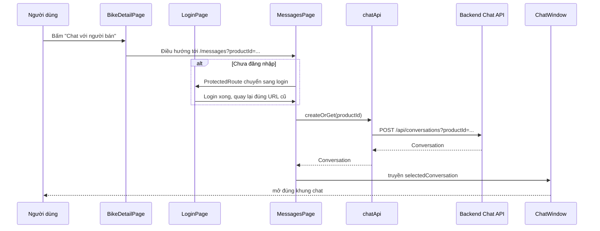
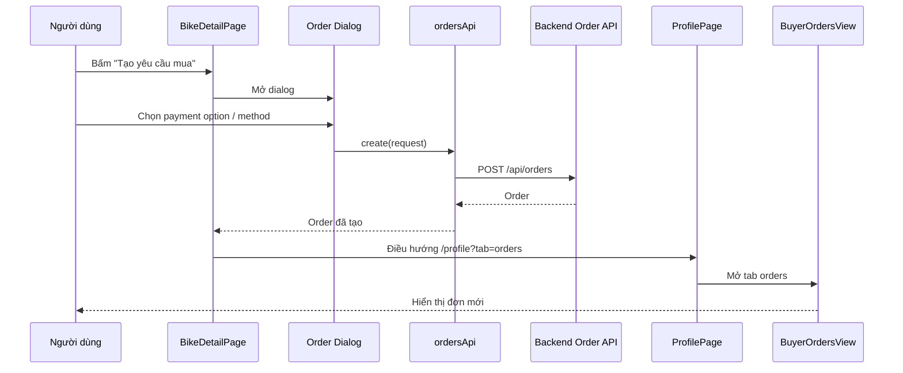

# Bike Detail, Chat Và Tạo Đơn Mua - 2026-03-18

## Bối cảnh

Trong FE này, sau khi Dev 1 đã nối được:

- danh sách đơn mua
- payment request
- refund
- chat page

thì vẫn còn một khoảng trống quan trọng:

- người dùng đứng ở trang chi tiết xe nhưng chưa đi được trọn flow thật
- nút chat mới chỉ dẫn sang trang `/messages`
- chưa có chỗ tạo đơn mua ngay từ trang chi tiết xe

Task lần này giải quyết đúng khoảng trống đó.

## Định nghĩa các khái niệm

### `BikeDetailPage`

Đây là trang chi tiết của một chiếc xe.

Nó thường là nơi người dùng:

- xem ảnh
- xem thông số
- xem người bán
- quyết định có chat hay tạo đơn mua hay không

### `query string`

`query string` là phần nằm sau dấu `?` trong URL.

Ví dụ:

```text
/messages?productId=abc-123
```

Ở đây:

- đường dẫn chính là `/messages`
- `productId=abc-123` là dữ liệu phụ được đính kèm vào URL

### `bootstrap conversation`

Ở đây, "bootstrap conversation" có nghĩa là:

- lấy `productId` từ URL
- gọi API để tạo hoặc lấy cuộc trò chuyện đã tồn tại
- rồi mở đúng chat đó lên ngay

Nói đơn giản: người dùng bấm chat ở trang chi tiết xe, vào trang messages là đã thấy đúng cuộc trò chuyện cần mở.

### `bridge`

`bridge` nghĩa là "cầu nối".

Trong task này có 2 cầu nối chính:

1. `BikeDetailPage -> MessagesPage`
2. `BikeDetailPage -> tạo order -> ProfilePage`

## Những gì đã đổi trong code

### 1. Chat từ trang chi tiết xe

Các file chính:

- [BikeDetailPage.tsx](/e:/Old_bicycle_system/old-bicycles-project/fe/src/pages/BikeDetailPage.tsx)
- [MessagesPage.tsx](/e:/Old_bicycle_system/old-bicycles-project/fe/src/pages/messages/MessagesPage.tsx)
- [LoginPage.tsx](/e:/Old_bicycle_system/old-bicycles-project/fe/src/pages/LoginPage.tsx)

Ý tưởng:

- `BikeDetailPage` dẫn sang `/messages?productId=<id>`
- `MessagesPage` đọc `productId`
- FE gọi `chatApi.createOrGet(productId)`
- backend trả về conversation
- FE mở đúng conversation đó trong `ChatWindow`

### 2. Tạo đơn mua từ trang chi tiết xe

Các file chính:

- [BikeDetailPage.tsx](/e:/Old_bicycle_system/old-bicycles-project/fe/src/pages/BikeDetailPage.tsx)
- [orders.api.ts](/e:/Old_bicycle_system/old-bicycles-project/fe/src/api/orders.api.ts)
- [ProfilePage.tsx](/e:/Old_bicycle_system/old-bicycles-project/fe/src/pages/ProfilePage.tsx)

Ý tưởng:

- người mua bấm nút `Tạo yêu cầu mua`
- mở dialog chọn:
  - `paymentOption`
  - `paymentMethod`
  - `upfrontAmount` nếu là đặt cọc một phần
- FE gọi `POST /api/orders`
- tạo đơn xong thì chuyển sang `/profile?tab=orders`
- `ProfilePage` đọc query `tab=orders` và tự mở tab đơn mua

### 3. Giữ lại query string sau login

File chính:

- [LoginPage.tsx](/e:/Old_bicycle_system/old-bicycles-project/fe/src/pages/LoginPage.tsx)

Trước đây:

- `ProtectedRoute` có giữ `location`
- nhưng `LoginPage` chỉ lấy `pathname`
- nên bị mất phần `?productId=...`

Sau khi sửa:

- `LoginPage` ghép lại cả `pathname + search`
- nên flow chat từ trang chi tiết xe không bị gãy sau login

## Luồng đi của chat từ trang chi tiết xe

### Luồng runtime



### Giải thích đơn giản

1. Người dùng đang xem một chiếc xe.
2. Họ bấm nút chat.
3. FE mang theo `productId` của chiếc xe đó sang trang messages.
4. Trang messages không chờ người dùng tự chọn tay, mà tự gọi API để lấy đúng conversation.
5. Nếu cuộc trò chuyện đã có thì backend trả lại cái cũ.
6. Nếu chưa có thì backend tạo mới.
7. FE mở `ChatWindow` luôn.

## Luồng đi của tạo đơn mua từ trang chi tiết xe

### Luồng runtime



### Giải thích đơn giản

1. Người mua không cần đi vòng qua một màn tạm nào khác.
2. Họ tạo đơn ngay từ trang chi tiết xe.
3. FE gửi dữ liệu thật lên backend.
4. Sau khi tạo thành công, FE chuyển người dùng sang đúng tab đơn mua để theo dõi bước tiếp theo.

## Các file FE nối với nhau như thế nào

### Flow chat

1. [BikeDetailPage.tsx](/e:/Old_bicycle_system/old-bicycles-project/fe/src/pages/BikeDetailPage.tsx)
   - tạo link có `productId`
2. [ProtectedRoute.tsx](/e:/Old_bicycle_system/old-bicycles-project/fe/src/router/ProtectedRoute.tsx)
   - chặn nếu chưa login
3. [LoginPage.tsx](/e:/Old_bicycle_system/old-bicycles-project/fe/src/pages/LoginPage.tsx)
   - trả người dùng về đúng URL cũ
4. [MessagesPage.tsx](/e:/Old_bicycle_system/old-bicycles-project/fe/src/pages/messages/MessagesPage.tsx)
   - đọc `productId`
   - gọi `chatApi.createOrGet`
5. [chat.api.ts](/e:/Old_bicycle_system/old-bicycles-project/fe/src/api/chat.api.ts)
   - gọi backend
6. [ChatWindow.tsx](/e:/Old_bicycle_system/old-bicycles-project/fe/src/components/messages/ChatWindow.tsx)
   - hiển thị tin nhắn

### Flow tạo order

1. [BikeDetailPage.tsx](/e:/Old_bicycle_system/old-bicycles-project/fe/src/pages/BikeDetailPage.tsx)
   - mở dialog
   - giữ state form
   - submit
2. [orders.api.ts](/e:/Old_bicycle_system/old-bicycles-project/fe/src/api/orders.api.ts)
   - gọi `POST /api/orders`
3. [ProfilePage.tsx](/e:/Old_bicycle_system/old-bicycles-project/fe/src/pages/ProfilePage.tsx)
   - đọc `tab=orders`
4. [BuyerOrdersView.tsx](/e:/Old_bicycle_system/old-bicycles-project/fe/src/components/profile/BuyerOrdersView.tsx)
   - render đơn mua thật

## Vì sao phải sửa `LoginPage`

Đây là điểm nhiều người mới học dễ bỏ sót.

Họ thường nghĩ:

- `ProtectedRoute` đã redirect đúng
- vậy login xong chắc chắn sẽ quay lại đúng chỗ

Nhưng thực tế:

- nếu chỉ lưu `pathname`
- bạn sẽ mất `search`
- tức là mất `?productId=...`

Ví dụ:

```text
Đúng cần giữ: /messages?productId=abc
Sai nếu chỉ giữ pathname: /messages
```

Nếu quay lại `/messages` mà không có `productId`, FE sẽ không biết phải mở cuộc trò chuyện nào.

## Vì sao `ProfilePage` cần hiểu `?tab=orders`

Nếu không có phần này, sau khi tạo đơn:

- FE chỉ điều hướng tới `/profile`
- nhưng người dùng vẫn phải tự bấm lại tab đơn mua

Đó là trải nghiệm không mượt.

Sửa `ProfilePage` để hiểu `?tab=orders` giúp:

- điều hướng có chủ đích hơn
- Dev 1 nối được flow order trọn vẹn
- không cần tạo thêm một màn trung gian mới

## Phần nào của Dev 2 và Dev 3 bị ảnh hưởng?

### Kết luận ngắn

Không có phần nào bị vỡ bắt buộc phải sửa ngay.

### Nhưng có 3 lưu ý quan trọng

1. `completed` giờ là trạng thái sau khi buyer xác nhận đã nhận xe.
2. Có thêm `awaiting_buyer_confirmation`.
3. Nếu một flow cần quay lại đúng trang cũ sau login, phải nhớ giữ cả `pathname` và `search`.

## Ví dụ request thật

### Tạo conversation

```http
POST /api/conversations?productId=7d0e...abc
Authorization: Bearer <token>
```

### Tạo order

```json
{
  "productId": "7d0e...abc",
  "paymentMethod": "transfer",
  "paymentOption": "partial",
  "upfrontAmount": 5000000
}
```

## Hiểu lầm thường gặp

### 1. "Chat button chỉ cần link sang `/messages` là đủ"

Sai.

Vì trang messages còn phải biết đang chat cho chiếc xe nào.

### 2. "Sau login kiểu gì cũng quay về đúng flow"

Sai.

Nếu không giữ `search`, flow sẽ gãy.

### 3. "Tạo order xong thì cứ về profile là được"

Chưa đủ tốt.

Người dùng cần được đưa vào đúng tab để tiếp tục theo dõi đơn.

## Tóm tắt

Task này tạo ra 2 cầu nối rất quan trọng:

- từ `BikeDetailPage` sang chat thật
- từ `BikeDetailPage` sang order thật

Điểm quan trọng nhất không chỉ là gọi API thành công, mà là:

- giữ được ngữ cảnh khi điều hướng
- không làm mất `productId` sau login
- và đưa người dùng tới đúng nơi sau khi tạo đơn
