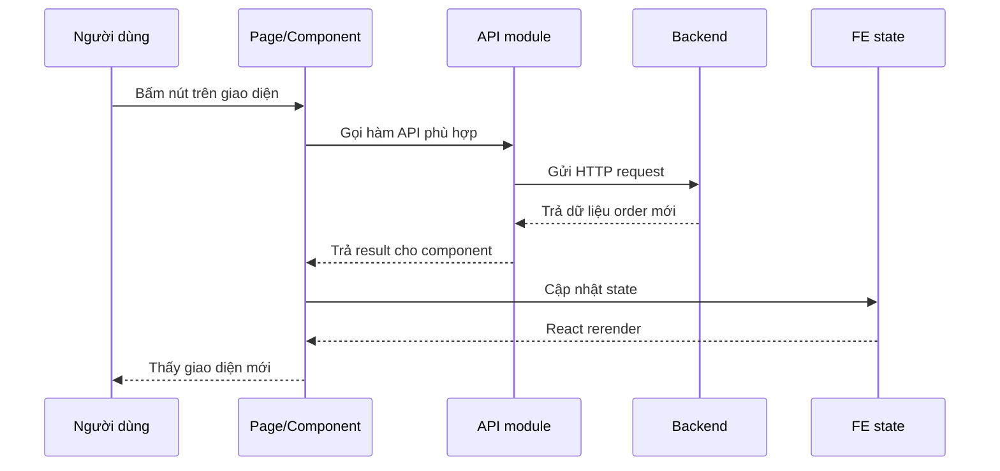

# FE Luồng Buyer Xác Nhận Đã Nhận Xe

## Mục tiêu

Note này giải thích phần FE Dev 1 vừa chỉnh cho luồng order:

1. seller báo đã giao xe
2. buyer xác nhận đã nhận xe
3. hệ thống mới chốt giao dịch

Note được viết cho người mới học React và mới bắt đầu tích hợp API.

## Bối cảnh

Trước thay đổi này, UI rất dễ hiểu nhầm rằng:

- seller bấm hoàn tất
- giao dịch kết thúc ngay

Sau khi backend đổi semantics, FE cũng phải đổi theo để không hiển thị sai.

Điểm quan trọng là:

- seller không còn “complete” giao dịch thật sự
- seller chỉ “báo đã giao xe”
- buyer mới là người có bước xác nhận cuối

## Thuật ngữ cần biết

### 1. State là gì?

`State` là dữ liệu đang sống bên trong component React.

Ví dụ trong `BuyerOrdersView.tsx`, state gồm:

- danh sách order
- lỗi hiện tại
- order nào đang mở modal refund
- order nào đang loading action

Khi state đổi, React render lại giao diện.

### 2. Rerender là gì?

`Rerender` là việc React vẽ lại giao diện sau khi state hoặc props thay đổi.

Ví dụ:

- buyer bấm “Xác nhận đã nhận xe”
- API trả order mới
- FE gọi `replaceOrder(updatedOrder)`
- state đổi
- component render lại với trạng thái mới

### 3. API module là gì?

API module là file gom các hàm gọi backend.

Ví dụ:

- [orders.api.ts](/e:/Old_bicycle_system/old-bicycles-project/fe/src/api/orders.api.ts)

Thay vì mỗi component tự viết `fetch` hoặc `axios`, ta gom vào một chỗ để:

- dễ tái sử dụng
- dễ sửa endpoint
- dễ test hơn

### 4. Helper hiển thị là gì?

Helper hiển thị là file chứa logic “nên render cái gì”.

Trong task này, file đó là:

- [order-display.ts](/e:/Old_bicycle_system/old-bicycles-project/fe/src/lib/order-display.ts)

Nó giúp page không bị nhồi quá nhiều `if` trực tiếp trong JSX.

## Những file FE chính tham gia task này

- [SellerOrdersPage.tsx](/e:/Old_bicycle_system/old-bicycles-project/fe/src/pages/seller/SellerOrdersPage.tsx)
- [BuyerOrdersView.tsx](/e:/Old_bicycle_system/old-bicycles-project/fe/src/components/profile/BuyerOrdersView.tsx)
- [DisputeModal.tsx](/e:/Old_bicycle_system/old-bicycles-project/fe/src/components/profile/DisputeModal.tsx)
- [orders.api.ts](/e:/Old_bicycle_system/old-bicycles-project/fe/src/api/orders.api.ts)
- [payments.api.ts](/e:/Old_bicycle_system/old-bicycles-project/fe/src/api/payments.api.ts)
- [refunds.api.ts](/e:/Old_bicycle_system/old-bicycles-project/fe/src/api/refunds.api.ts)
- [order.ts](/e:/Old_bicycle_system/old-bicycles-project/fe/src/types/order.ts)
- [order-display.ts](/e:/Old_bicycle_system/old-bicycles-project/fe/src/lib/order-display.ts)

## FE flow tổng quát



## Luồng 1: Seller báo đã giao xe

### FE đi qua những file nào?

1. người dùng mở:
   - [SellerOrdersPage.tsx](/e:/Old_bicycle_system/old-bicycles-project/fe/src/pages/seller/SellerOrdersPage.tsx)
2. page gọi:
   - `ordersApi.getMine()`
3. page hiển thị nút:
   - `Báo đã giao xe`
4. khi bấm nút, page gọi:
   - `ordersApi.complete(order.id)`
5. backend trả về order mới với:
   - `status = awaiting_buyer_confirmation`
6. page gọi:
   - `replaceOrder(updatedOrder)`
7. UI render lại badge và helper text mới

### Vì sao seller page phải đổi chữ?

Nếu vẫn để nút là:

- `Hoàn tất đơn`

thì người dùng sẽ tưởng:

- bấm nút này là giao dịch đã đóng hẳn

Nhưng backend mới không làm vậy nữa. Nên FE phải đổi copy thành:

- `Báo đã giao xe`

để đúng nghĩa nghiệp vụ.

## Luồng 2: Buyer xác nhận đã nhận xe

### FE đi qua những file nào?

1. buyer vào:
   - [BuyerOrdersView.tsx](/e:/Old_bicycle_system/old-bicycles-project/fe/src/components/profile/BuyerOrdersView.tsx)
2. component load order bằng:
   - `ordersApi.getMine()`
3. logic hiển thị kiểm tra:
   - `canBuyerConfirmReceived(order)`
4. nếu đúng, render nút:
   - `Xác nhận đã nhận xe`
5. khi buyer bấm, FE gọi:
   - `ordersApi.confirmReceived(order.id)`
6. backend trả order mới:
   - `status = completed`
   - `fundingStatus = released`
7. FE cập nhật state
8. giao diện đổi sang trạng thái hoàn tất

## Luồng 3: Buyer vẫn có thể yêu cầu hoàn tiền

Đây là điểm rất quan trọng.

Trong UI mới, buyer vẫn được mở refund khi:

- `status = deposited`
  hoặc
- `status = awaiting_buyer_confirmation`

và:

- `fundingStatus = held`

Logic này nằm ở:

- [order-display.ts](/e:/Old_bicycle_system/old-bicycles-project/fe/src/lib/order-display.ts)

Điều đó có nghĩa là:

- seller đã báo giao xe
- nhưng tiền vẫn đang bị giữ
- buyer vẫn có quyền báo có vấn đề và mở refund

## Vai trò của từng file trong task này

### `order.ts`

File này khai báo kiểu dữ liệu TypeScript cho order.

Ở task này, nó được mở rộng thêm:

- `'awaiting_buyer_confirmation'`

Nếu quên update type này, FE sẽ:

- không hiểu trạng thái mới
- dễ báo lỗi TypeScript
- hoặc hiển thị sai logic

### `orders.api.ts`

File này thêm API mới:

- `confirmReceived(orderId)`

Nó là cầu nối giữa component và backend.

### `order-display.ts`

File này gom các rule hiển thị như:

- label trạng thái là gì
- khi nào seller được báo giao xe
- khi nào buyer được xác nhận đã nhận xe
- khi nào buyer còn được refund

### `SellerOrdersPage.tsx`

Page này chịu trách nhiệm:

- load order của seller
- render đúng action seller được phép làm
- cập nhật lại state sau mỗi action

### `BuyerOrdersView.tsx`

Component này chịu trách nhiệm:

- load order của buyer
- hiển thị hướng dẫn thanh toán
- mở refund modal
- gọi API xác nhận đã nhận xe

### `DisputeModal.tsx`

Modal này chỉ tập trung vào form refund:

- chọn lý do
- nhập ghi chú
- submit dữ liệu về page cha

## Ví dụ dễ hiểu

### Ví dụ 1: Seller báo đã giao xe

Order ban đầu:

```text
status = deposited
fundingStatus = held
```

Seller bấm nút:

- `Báo đã giao xe`

Backend trả về:

```text
status = awaiting_buyer_confirmation
fundingStatus = held
```

FE render lại:

- badge = `Chờ người mua xác nhận`
- buyer thấy nút xác nhận

### Ví dụ 2: Buyer xác nhận đã nhận xe

Order hiện tại:

```text
status = awaiting_buyer_confirmation
fundingStatus = held
```

Buyer bấm:

- `Xác nhận đã nhận xe`

Backend trả về:

```text
status = completed
fundingStatus = released
```

FE render lại:

- badge = `Hoàn tất`
- không còn nút xác nhận

## Những lưu ý khi FE tích hợp luồng này

### 1. Đừng tự đoán nghiệp vụ từ tên hàm cũ

Hàm `ordersApi.complete()` nghe như “complete thật”.

Nhưng trong version mới, ở góc nhìn UI seller, nó chỉ có nghĩa là:

- seller báo đã giao xe

Cho nên:

- text trên nút
- helper text
- tài liệu handoff

đều phải đổi theo semantics mới.

### 2. Luôn nhìn cả `status` và `fundingStatus`

Không đủ nếu chỉ nhìn `status`.

Hai field này đi cùng nhau để diễn tả đúng nghiệp vụ.

### 3. Refund và confirm received có thể cùng liên quan tới một trạng thái

Ở `awaiting_buyer_confirmation`, buyer:

- có thể xác nhận đã nhận xe
- hoặc vẫn có thể yêu cầu hoàn tiền nếu phát hiện vấn đề

FE không được hardcode rằng “đã giao xe thì chỉ còn complete”.

## Test đã có

Để khóa logic hiển thị, đã có test ở:

- [order-display.test.ts](/e:/Old_bicycle_system/old-bicycles-project/fe/src/lib/order-display.test.ts)

Test này kiểm tra:

- seller khi nào được accept
- buyer khi nào được thanh toán
- seller khi nào được báo giao xe
- buyer khi nào được xác nhận đã nhận xe
- buyer khi nào được refund

## Kết luận

Task này không chỉ là thêm một nút mới.

Nó là việc làm cho FE hiểu đúng state machine mới của backend:

- seller báo đã giao xe
- buyer xác nhận đã nhận xe
- hệ thống mới hoàn tất thật sự

Nhờ vậy:

- giao diện đúng hơn
- người dùng ít hiểu nhầm hơn
- FE và BE khớp nhau chặt hơn
- logic refund cũng an toàn hơn
