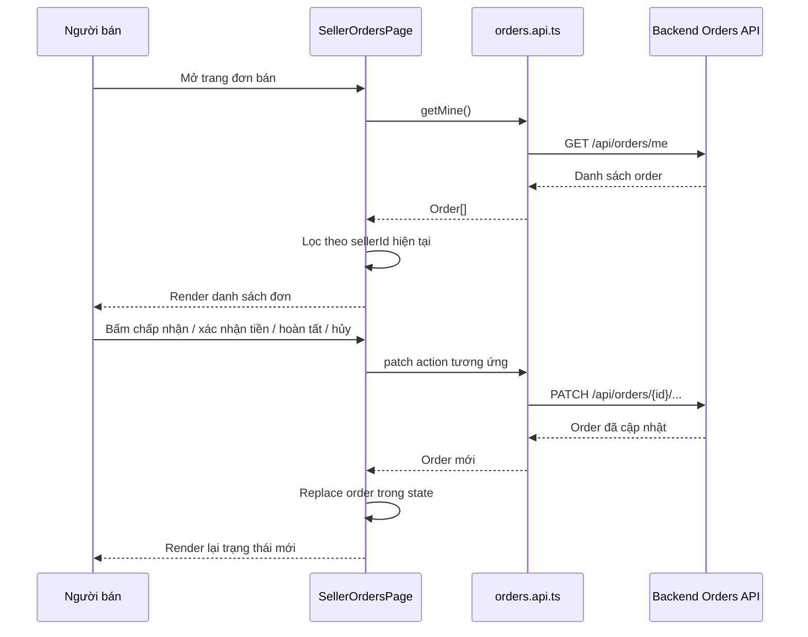
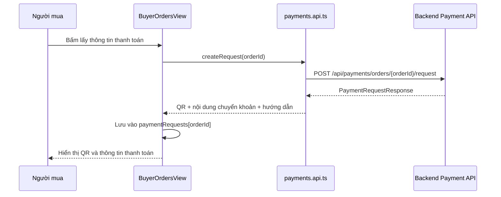
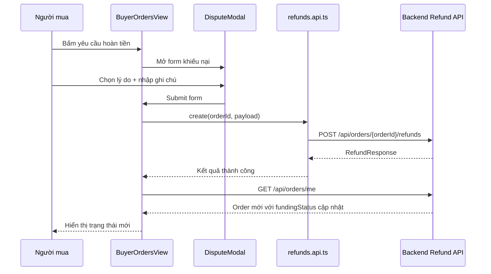

# Buyer Seller Order Payment Refund Flow Basics - 2026-03-17

## Mục Tiêu

Giải thích dễ hiểu cách FE Dev 1 vừa nối 3 phần:

- seller orders
- buyer payment request
- buyer refund request

Đây là note dành cho người mới học React và mới học tích hợp API.

## Bối Cảnh

Trước khi nối API thật:

- `SellerOrdersPage.tsx` dùng dữ liệu giả
- `BuyerOrdersView.tsx` dùng mảng order giả
- `DisputeModal.tsx` chỉ là giao diện, chưa gọi backend

Điều này làm FE trông có vẻ chạy được, nhưng thực tế:

- không biết backend trả trạng thái gì
- không biết nút nào thật sự hợp lệ
- rất dễ dựng sai luồng nghiệp vụ

## Thuật Ngữ Cần Biết

### 1. Order

`Order` là đơn hàng giữa người mua và người bán.

Trong dự án này, order có 2 lớp trạng thái quan trọng:

- `status`
- `fundingStatus`

### 2. status

`status` là trạng thái chính của đơn hàng.

Ví dụ:

- `pending`
- `deposited`
- `completed`
- `cancelled`

### 3. fundingStatus

`fundingStatus` là trạng thái của dòng tiền.

Ví dụ:

- `unpaid`
- `awaiting_payment`
- `held`
- `released`
- `refund_pending`
- `refunded`

Nói ngắn gọn:

- `status` cho biết đơn hàng đang ở bước nào
- `fundingStatus` cho biết tiền đang ở trạng thái nào

## Vì Sao FE Không Được Đoán Trạng Thái Theo Cảm Tính?

Nếu FE chỉ nhìn `status`, rất dễ hiểu sai.

Ví dụ:

- order vẫn là `pending`
- nhưng `fundingStatus` đã là `awaiting_payment`

Lúc đó:

- seller đã chấp nhận đơn
- buyer phải thanh toán

Nếu FE không nhìn `fundingStatus`, nó có thể vẫn hiển thị sai là “chờ người bán”.

## Những File Nào Đang Chạy Luồng Này?

### FE files

- [SellerOrdersPage.tsx](/e:/Old_bicycle_system/old-bicycles-project/fe/src/pages/seller/SellerOrdersPage.tsx)
- [BuyerOrdersView.tsx](/e:/Old_bicycle_system/old-bicycles-project/fe/src/components/profile/BuyerOrdersView.tsx)
- [DisputeModal.tsx](/e:/Old_bicycle_system/old-bicycles-project/fe/src/components/profile/DisputeModal.tsx)
- [order-display.ts](/e:/Old_bicycle_system/old-bicycles-project/fe/src/lib/order-display.ts)
- [orders.api.ts](/e:/Old_bicycle_system/old-bicycles-project/fe/src/api/orders.api.ts)
- [payments.api.ts](/e:/Old_bicycle_system/old-bicycles-project/fe/src/api/payments.api.ts)
- [refunds.api.ts](/e:/Old_bicycle_system/old-bicycles-project/fe/src/api/refunds.api.ts)

### Backend files liên quan

- [OrderController.java](/e:/Old_bicycle_system/BE_old_bicycle_project/old_bicycle_project/src/main/java/com/backend/old_bicycle_project/controller/OrderController.java)
- [RefundController.java](/e:/Old_bicycle_system/BE_old_bicycle_project/old_bicycle_project/src/main/java/com/backend/old_bicycle_project/controller/RefundController.java)
- [OrderServiceImpl.java](/e:/Old_bicycle_system/BE_old_bicycle_project/old_bicycle_project/src/main/java/com/backend/old_bicycle_project/service/impl/OrderServiceImpl.java)
- [RefundServiceImpl.java](/e:/Old_bicycle_system/BE_old_bicycle_project/old_bicycle_project/src/main/java/com/backend/old_bicycle_project/service/impl/RefundServiceImpl.java)
- [PaymentServiceImpl.java](/e:/Old_bicycle_system/BE_old_bicycle_project/old_bicycle_project/src/main/java/com/backend/old_bicycle_project/service/impl/PaymentServiceImpl.java)

## FE Luồng Đi Như Thế Nào?

### Luồng 1: Seller xem và xử lý đơn

### Giải thích dễ hiểu

1. Người bán mở trang.
2. FE gọi `GET /api/orders/me`.
3. Backend trả tất cả order liên quan tới user đó.
4. FE giữ lại những order mà `sellerId` trùng với user hiện tại.
5. Khi seller bấm nút action, FE gọi đúng API tương ứng.
6. Backend trả về `Order` mới sau khi cập nhật.
7. FE thay bản ghi cũ trong state bằng bản ghi mới.
8. Giao diện tự render lại.

## Luồng 2: Buyer lấy thông tin thanh toán

### Giải thích dễ hiểu

Buyer không tự gọi webhook.

Buyer chỉ:

1. bấm nút lấy thông tin thanh toán
2. nhận QR hoặc nội dung chuyển khoản từ backend
3. chuyển tiền theo hướng dẫn
4. FE đợi backend đổi trạng thái order sau khi webhook xử lý xong

## Luồng 3: Buyer gửi yêu cầu hoàn tiền

## Vai Trò Của `order-display.ts`

File [order-display.ts](/e:/Old_bicycle_system/old-bicycles-project/fe/src/lib/order-display.ts) là nơi gom business rule hiển thị.

Nó trả lời các câu hỏi như:

- đơn này nên hiện label gì?
- buyer có được thanh toán không?
- buyer có được refund không?
- seller có được accept không?
- seller có được complete không?

Việc gom rule vào một file riêng giúp:

- page dễ đọc hơn
- logic ít bị lặp lại
- dễ viết test hơn

## Vì Sao Buyer Không Có Nút “Đã Nhận Xe”?

Đây là một điểm rất quan trọng.

Backend hiện không có API cho buyer tự complete order.

Người được gọi `complete` là:

- seller
- hoặc admin

Nên FE phải sửa lại cho đúng backend:

- buyer thanh toán
- buyer theo dõi trạng thái
- buyer yêu cầu hoàn tiền nếu cần

chứ không được giữ flow giả “buyer xác nhận đã nhận xe” như mock cũ.

## Những Nút FE Hiện Đang Bám Theo Backend Thật

### Seller

- `accept`
- `confirm-deposit` với đơn tiền mặt
- `complete`
- `cancel`

### Buyer

- lấy thông tin thanh toán
- hủy đơn khi order còn mở
- yêu cầu hoàn tiền khi order đã `deposited` và tiền đang `held`

## Những Giới Hạn Hiện Tại

### 1. Chưa có upload file thật cho khiếu nại

Modal hiện chỉ gửi:

- `reason`
- `evidenceNote`

Chưa có API upload ảnh/video riêng cho refund.

### 2. FE đang poll order list, chưa có realtime riêng cho payment

Buyer page hiện refresh order theo chu kỳ để thấy trạng thái mới.

Điều này đủ dùng cho giai đoạn hiện tại, nhưng chưa phải cách realtime đẹp nhất.

### 3. Admin review refund chưa được nối ở tranche này

Luồng admin:

- approve refund
- reject refund
- complete refund

vẫn là phần tiếp theo nếu Dev 1 được giao thêm màn admin dispute.

## Test Đã Có

Để khóa lại rule nghiệp vụ hiển thị, đã thêm test ở:

- [order-display.test.ts](/e:/Old_bicycle_system/old-bicycles-project/fe/src/lib/order-display.test.ts)

Test này kiểm tra:

- khi nào seller được accept
- khi nào buyer được thanh toán
- khi nào seller được complete
- khi nào buyer được refund
- khi nào order phải hiện “đã hoàn tiền”

## Kết Luận

Task này quan trọng vì nó biến một cụm màn hình “trông như có flow” thành cụm màn hình bám đúng backend thật.

Điểm mấu chốt cần nhớ:

1. FE không tự bịa trạng thái.
2. FE phải nhìn cả `status` và `fundingStatus`.
3. Buyer payment và buyer refund là 2 luồng khác nhau.
4. Buyer không có API tự complete đơn.
5. Gom business rule vào helper riêng sẽ giúp page sạch và dễ test hơn.
