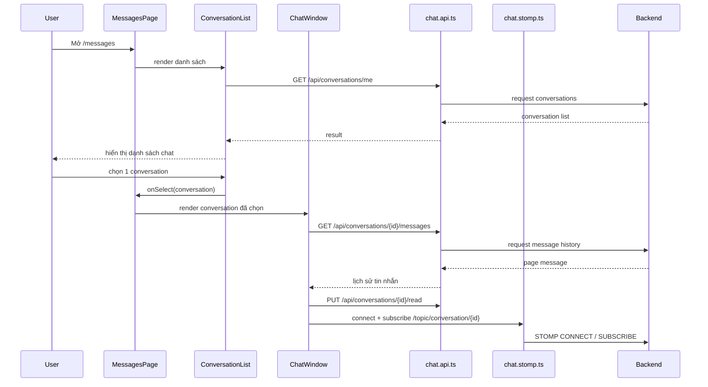
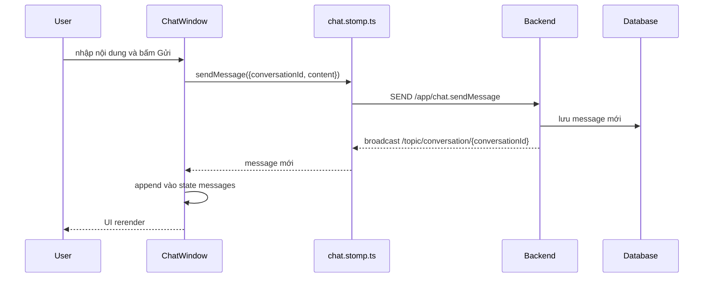

# Chat REST Và STOMP Integration Basics - 2026-03-17

## Mục Tiêu

Giải thích thật dễ hiểu cách phần chat của FE đang được nối với backend trong dự án này.

Tài liệu này dành cho người mới học lập trình, nên sẽ đi từ khái niệm cơ bản đến luồng chạy thật trong code.

## 1. Chat Trong Dự Án Này Không Chỉ Có Một Kiểu API

Phần chat ở đây dùng **2 kiểu giao tiếp khác nhau**:

- **REST API**
  - dùng để lấy dữ liệu có sẵn từ server
  - ví dụ: lấy danh sách cuộc trò chuyện, lấy lịch sử tin nhắn, đánh dấu đã đọc
- **WebSocket STOMP**
  - dùng để nhận và gửi tin nhắn mới theo thời gian thực
  - tức là không cần bấm refresh trang vẫn thấy tin nhắn mới chạy vào

Hiểu ngắn gọn:

- REST giống như hỏi server: "Cho tôi xem dữ liệu hiện tại"
- WebSocket giống như giữ một đường dây mở sẵn để server đẩy sự kiện mới về ngay

## 2. Vì Sao Không Chỉ Dùng REST

Nếu chỉ dùng REST:

- mỗi lần có tin nhắn mới, FE phải gọi API lại liên tục
- người dùng sẽ thấy chậm hơn
- tốn request hơn

Nếu chỉ dùng WebSocket:

- khi vừa mở trang chat, FE không có sẵn lịch sử cũ
- nếu mất kết nối rồi quay lại, sẽ khó lấy lại toàn bộ dữ liệu nền

Nên cách đúng là:

- **REST để lấy nền**
- **WebSocket để cập nhật realtime**

## 3. STOMP Là Gì

`STOMP` là một giao thức nhắn tin đơn giản chạy trên WebSocket.

Bạn có thể hiểu nó như "ngôn ngữ" mà FE và BE dùng để:

- connect
- subscribe vào một channel
- send message
- nhận message

Trong dự án này:

- FE gửi tin nhắn tới:
  - `/app/chat.sendMessage`
- FE subscribe để nhận message mới của cuộc trò chuyện đang mở:
  - `/topic/conversation/{conversationId}`

## 4. Những File FE Liên Quan Đến Chat

### `src/pages/messages/MessagesPage.tsx`

Đây là page bao ngoài.

Nó chia màn hình thành 2 cột:

- cột trái: danh sách conversation
- cột phải: khung chat

Page này giữ `selectedConversation` để biết hiện đang mở cuộc trò chuyện nào.

### `src/components/messages/ConversationList.tsx`

File này:

- gọi `chatApi.getMine()`
- render danh sách cuộc trò chuyện
- cho phép tìm kiếm local theo:
  - tên người chat
  - tên sản phẩm
  - nội dung tin nhắn cuối
- refresh định kỳ để danh sách không quá cũ

### `src/components/messages/ChatWindow.tsx`

File này:

- nhận `conversation` đang được chọn
- gọi REST để lấy lịch sử tin nhắn cũ
- gọi API mark-as-read
- mở STOMP socket
- subscribe vào topic conversation
- gửi message mới qua WebSocket

### `src/api/chat.api.ts`

Đây là lớp gọi REST API cho chat.

Nó đang có:

- `getMine()`
- `createOrGet(productId)`
- `getMessages(conversationId, page, size)`
- `markAsRead(conversationId)`

### `src/sockets/chat.stomp.ts`

Đây là lớp bọc WebSocket STOMP.

Nó chịu trách nhiệm:

- connect tới `/ws`
- gắn JWT vào lúc connect
- subscribe conversation topic
- subscribe inbox queue riêng
- send message tới `/app/chat.sendMessage`

### `src/lib/chat-display.ts`

Đây là file helper để tránh nhét quá nhiều logic hiển thị vào component.

Ví dụ:

- tìm ra "người đối diện" trong conversation
- format thời gian
- sort conversation mới nhất lên đầu
- sort tin nhắn theo thời gian tăng dần
- tránh append trùng message khi message realtime đến nhiều lần

## 5. Luồng Chạy Thật Khi Người Dùng Mở Trang Chat

## 6. Luồng Khi Gửi Tin Nhắn Mới

## 7. Vì Sao `ChatWindow` Vẫn Phải Gọi REST Trước Khi Connect Socket

Nếu chỉ connect socket:

- bạn chỉ nhận được tin nhắn mới từ lúc vừa connect trở đi
- các tin nhắn cũ sẽ không có

Nên `ChatWindow` phải:

1. lấy lịch sử cũ qua REST
2. sau đó mới connect socket
3. rồi lắng nghe message mới

Đây là pattern rất phổ biến của chat app.

## 8. JWT Trong Chat Dùng Để Làm Gì

`JWT` là token đăng nhập.

Trong chat, token này giúp backend biết:

- người nào đang connect
- người đó có quyền mở conversation đó hay không
- người đó đang gửi message với tư cách ai

Trong dự án này, token được truyền vào lúc STOMP connect trong `chat.stomp.ts`.

Nếu không có token hoặc token sai:

- socket có thể không connect được
- hoặc backend sẽ từ chối message

## 9. Những Khó Khăn FE Cần Nhớ Khi Tích Hợp Chat

### 1. Không phải dữ liệu nào backend cũng trả sẵn

REST conversation hiện **không trả `unreadCount`**.

Điều này có nghĩa:

- FE chưa thể render badge unread hoàn hảo chỉ bằng 1 request REST
- nếu muốn badge realtime tốt hơn, phải dựa thêm vào event inbox queue hoặc backend cần mở rộng DTO

### 2. Không có REST send message

Backend hiện không có kiểu:

- `POST /api/messages`

Tin nhắn mới bắt buộc đi qua WebSocket STOMP.

Nên nếu FE chỉ nối REST mà không nối socket:

- sẽ xem được history
- nhưng không gửi được tin nhắn thật

### 3. Realtime luôn khó hơn CRUD thường

Với page CRUD bình thường:

- click
- gửi request
- nhận response
- render

Với realtime:

- phải giữ kết nối lâu dài
- phải reconnect khi mạng chập chờn
- phải tránh trùng message
- phải đồng bộ giữa state cũ và event mới

## 10. Những Thuật Ngữ Cần Nhớ

### Conversation

Là một cuộc trò chuyện giữa buyer và seller, gắn với một sản phẩm.

### Message

Là một tin nhắn nằm bên trong conversation.

### Realtime

Là dữ liệu được cập nhật gần như ngay lập tức, không cần refresh tay.

### Subscribe

Là hành động FE "đăng ký nghe" một channel.

Ví dụ:

- FE subscribe `/topic/conversation/{id}`
- khi BE đẩy message vào topic đó, FE sẽ nhận được

### Topic

Là channel công khai theo nhóm.

Ở đây:

- mọi client đang mở cùng conversation sẽ nghe chung 1 topic

### Private Queue

Là channel riêng cho từng user.

Dự án này đã có nền ở `/user/queue/messages`, nhưng UI unread badge toàn cục vẫn chưa hoàn thiện.

## 11. Trạng Thái Hiện Tại Của Dev 1

Đã xong:

- chat page không còn dùng mock conversation/message
- chat history dùng REST thật
- mark-as-read dùng REST thật
- send message dùng STOMP thật
- receive message đang mở dùng topic thật

Chưa xong hoàn toàn:

- start chat từ `BikeDetailPage`
- unread badge toàn cục qua inbox queue
- reconnect/resubscribe nâng cao

## 12. Cách Đọc Luồng File Khi Debug Chat

Nếu chat lỗi, nên debug theo đúng thứ tự:

1. `MessagesPage.tsx`
   - đang chọn conversation nào
2. `ConversationList.tsx`
   - list có load được không
3. `ChatWindow.tsx`
   - history có load không
   - socket có connect không
4. `chat.api.ts`
   - REST endpoint đúng chưa
5. `chat.stomp.ts`
   - base URL và JWT có đúng không
6. backend `ChatController`
   - REST và `@MessageMapping` có nhận đúng không

Đây là cách debug theo luồng, thay vì đoán mò từng file một.
