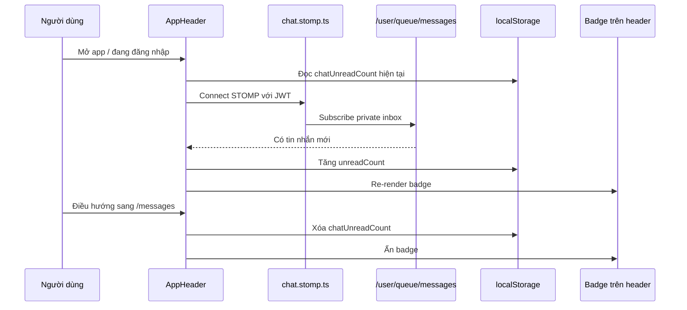

# Chat Unread Badge Và Ảnh Hưởng Lên Dev 2, Dev 3 - 2026-03-18

## Bối cảnh

Sau khi Dev 1 nối chat thật bằng `REST + WebSocket STOMP`, có một nhu cầu rất tự nhiên ở FE:

- khi người dùng đang ở trang khác
- và có tin nhắn mới gửi đến
- header nên báo rằng có tin nhắn chưa xem

Đây thường được gọi là **unread badge** hoặc **unread indicator**.

Trong dự án này, badge đó được gắn ở header, ngay cạnh mục điều hướng `Tin nhắn`.

## Unread badge là gì?

`Unread badge` là dấu hiệu nhỏ trên giao diện để báo:

- có dữ liệu mới
- người dùng chưa mở ra xem

Ví dụ dễ thấy:

- dấu chấm đỏ ở biểu tượng chat
- số `1`, `2`, `3` cạnh biểu tượng thông báo

Trong dự án này, unread badge của chat chưa phải là “số lượng unread tuyệt đối do server tính sẵn”. Nó mới là:

- một **chỉ báo realtime** ở FE
- được tăng lên khi FE nhận event tin nhắn mới qua WebSocket

## Vì sao lần này không dùng unread count từ REST?

Backend hiện có:

- `GET /api/conversations/me`
- `GET /api/conversations/{id}/messages`
- `PUT /api/conversations/{id}/read`
- STOMP private queue `/user/queue/messages`

Nhưng `GET /api/conversations/me` hiện **chưa trả `unreadCount` cho từng conversation**.

Điều này dẫn đến một thực tế:

- FE chưa thể hỏi server rằng “chính xác bây giờ có bao nhiêu tin nhắn chưa đọc”

Vì vậy, cách thực dụng nhất là:

1. nghe tin nhắn mới qua `/user/queue/messages`
2. tăng một biến unread ở FE
3. khi người dùng vào trang `/messages`, reset biến đó

Đây là giải pháp tốt cho MVP, vì:

- không cần đổi contract BE ngay
- không phá phần Dev 2 và Dev 3
- vẫn cho UX đủ tốt để người dùng biết có tin nhắn mới

## Những file nào tham gia vào flow này?

### 1. `src/layouts/AppHeader.tsx`

Đây là nơi hiển thị navigation toàn cục của người dùng.

Nó làm 3 việc:

- hiển thị mục `Tin nhắn`
- nghe event tin nhắn mới
- hiển thị badge unread

### 2. `src/lib/chat-unread.ts`

Đây là file helper nhỏ để làm việc với `localStorage`.

Nó có nhiệm vụ:

- đọc số unread đang lưu
- tăng số unread
- xóa unread khi cần

### 3. `src/sockets/chat.stomp.ts`

Đây là lớp bọc WebSocket/STOMP của dự án.

Nó có hàm:

- `subscribeToInbox()`

Hàm này subscribe vào:

```text
/user/queue/messages
```

Đây là channel riêng cho người dùng hiện tại.

### 4. `src/pages/messages/MessagesPage.tsx`

Khi người dùng vào trang tin nhắn, FE xem như:

- người dùng đã đi tới khu vực đọc tin nhắn

Nên unread badge được reset về `0`.

## `localStorage` là gì?

`localStorage` là nơi trình duyệt cho phép FE lưu một ít dữ liệu nhỏ dưới dạng key-value.

Ví dụ:

```ts
localStorage.setItem('chatUnreadCount', '3')
```

Điều này có nghĩa là:

- dù người dùng chuyển sang page khác trong cùng trình duyệt
- FE vẫn nhớ được badge unread

Trong task này, ta dùng `localStorage` để:

- giữ unread badge trong lúc người dùng vẫn đang online
- tránh mất ngay khi component header re-render

## Luồng đi thực tế của unread badge



## Giải thích lại luồng trên bằng lời rất đơn giản

### Bước 1. Người dùng mở ứng dụng

`AppHeader` được mount.

Nó sẽ:

- kiểm tra người dùng đã đăng nhập chưa
- nếu đã đăng nhập, lấy token
- dùng token đó để mở kết nối WebSocket/STOMP

### Bước 2. Header lắng nghe private queue

Header không cần tự viết code WebSocket từ đầu.

Nó dùng:

- `createChatSocketClient()`
- rồi gọi `subscribeToInbox()`

Nhờ vậy, khi backend đẩy một tin nhắn mới về private queue của user, FE sẽ nhận được event đó.

### Bước 3. FE tăng unread badge

Khi event đến:

- nếu người dùng **không ở trang `/messages`**
- FE sẽ tăng unread count trong `localStorage`

Sau đó React re-render, nên badge ở header hiện ra.

### Bước 4. Người dùng vào trang tin nhắn

Khi route hiện tại là `/messages`:

- FE clear unread count
- badge biến mất

Điều này có nghĩa:

- FE coi việc “đi vào khu chat” là đã quay lại vùng đọc tin nhắn

## Vì sao thay đổi này không bắt Dev 2 và Dev 3 phải sửa code ngay?

Lý do là vì phần mới được làm theo kiểu **đóng gói trong shared layer**.

Phần logic chính nằm ở:

- `AppHeader.tsx`
- `chat-unread.ts`

Dev 2 và Dev 3 không cần sửa:

- page marketplace
- page admin users
- page reports
- page notifications

Họ chỉ cần biết:

1. header giờ đã có unread badge cho chat
2. không nên tự viết thêm một unread badge khác ở chỗ khác
3. nếu họ đụng layout hoặc navigation, phải giữ lại logic này

## Ảnh hưởng về semantics từ các thay đổi Dev 1 trước đó

Ngoài unread badge, Dev 1 còn làm thêm:

- `BikeDetailPage -> MessagesPage?productId=...`
- `BikeDetailPage -> create order -> /profile?tab=orders`
- `buyer confirm received`

Những thay đổi này **không ép Dev 2 và Dev 3 sửa code ngay**, nhưng họ phải hiểu đúng nghĩa:

### 1. `completed`

Bây giờ `completed` không còn nghĩa là:

- seller bấm hoàn tất là xong ngay

Mà là:

- buyer đã xác nhận nhận xe xong

### 2. `awaiting_buyer_confirmation`

Đây là trạng thái trung gian mới.

Nó có nghĩa:

- seller đã báo giao xe
- buyer chưa xác nhận đã nhận

### 3. `?productId=...` ở trang messages

Nếu một bạn khác sửa login redirect hoặc route messages, phải nhớ:

- query string này là dữ liệu quan trọng
- FE dùng nó để tự tạo/lấy conversation từ trang chi tiết xe

### 4. `?tab=orders` ở profile

Nếu ai sửa `ProfilePage`, phải nhớ:

- query này giúp FE nhảy đúng sang tab đơn hàng sau khi tạo order

## Ví dụ nhỏ để dễ hình dung

### Trường hợp 1: người dùng đang ở trang chủ

- seller gửi tin nhắn mới
- backend push về `/user/queue/messages`
- header tăng unread badge lên `1`

### Trường hợp 2: người dùng bấm vào trang tin nhắn

- FE thấy route là `/messages`
- unread badge được xóa

### Trường hợp 3: người dùng refresh trình duyệt

Do unread tạm được giữ trong `localStorage`, badge có thể vẫn còn.

Đây là điểm tiện:

- FE không mất trạng thái ngay

Nhưng cũng có giới hạn:

- số này chưa chắc là “đếm đúng tuyệt đối theo server”

## Hạn chế hiện tại

Giải pháp này vẫn có giới hạn:

1. Nó không phải unread count chuẩn từ backend
2. Nếu người dùng đăng xuất hoặc đổi thiết bị, unread count FE cũ không còn ý nghĩa
3. Nếu cần tính unread cực chính xác, backend nên trả thêm `unreadCount`

Tức là:

- hiện tại đây là giải pháp **thực dụng**
- phù hợp để MVP chạy mượt
- nhưng chưa phải trạng thái cuối cùng đẹp nhất

## Nếu sau này muốn nâng cấp

Hướng tốt hơn về lâu dài là:

1. backend trả `unreadCount` trong `GET /api/conversations/me`
2. FE dùng unreadCount đó làm source of truth
3. STOMP chỉ đóng vai trò “báo có gì mới”, rồi FE refetch dữ liệu chuẩn từ server

Khi đó:

- unread badge sẽ chính xác hơn
- refresh trang cũng không làm lệch trạng thái

## Tóm tắt ngắn

- Dev 1 đã thêm unread badge chat toàn cục ở header
- Badge này dùng WebSocket STOMP + `localStorage`
- Dev 2 và Dev 3 không phải sửa code ngay
- Nhưng họ cần hiểu đúng semantics mới của:
  - `completed`
  - `awaiting_buyer_confirmation`
  - `?productId=...`
  - `?tab=orders`
