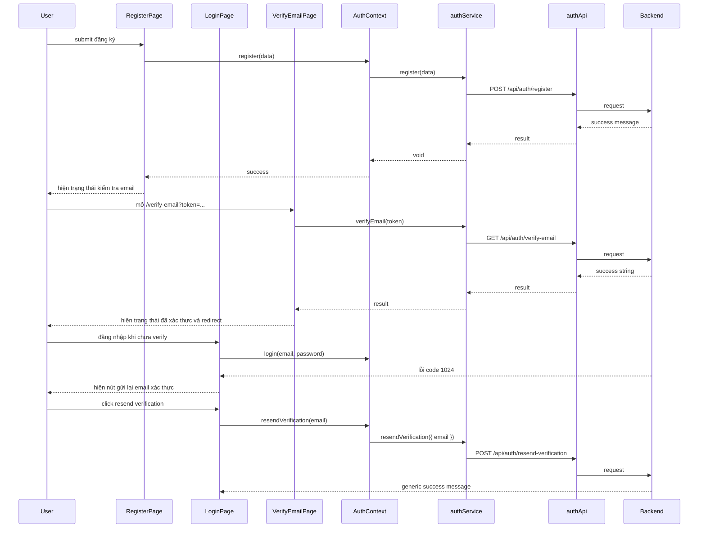

# Email verification resend and deploy link FE basics - 2026-03-25

## 1. Bài toán

Frontend có page:

- `/verify-email`

Page này đọc `token` từ URL, gọi backend verify API, rồi điều hướng user về trang đăng nhập hoặc trang chủ tùy kết quả.

Nhưng nếu email gửi cho user lại chứa link:

```text
/api/auth/verify-email?token=...
```

thì trên môi trường deploy FE riêng và BE riêng, trình duyệt có thể đi thẳng vào backend thay vì vào page FE.

## 2. Điều đã thay đổi

### 2.1 Link trong email

Backend giờ gửi link FE thật:

```text
/verify-email?token=...
```

Điều này giúp user luôn mở đúng màn hình xác thực email của frontend.

### 2.2 Luồng recovery khi chưa nhận được email

FE thêm khả năng gọi:

```text
POST /api/auth/resend-verification
```

ở 2 chỗ:

- sau khi đăng ký thành công
- sau khi đăng nhập bị backend trả lỗi `EMAIL_NOT_VERIFIED`

## 3. Luồng FE mới



## 4. Giải thích dễ hiểu

### RegisterPage

Sau khi đăng ký thành công, page không tự đăng nhập user.

Thay vào đó, page:

- báo user kiểm tra email
- hiện thêm nút gửi lại email xác thực nếu mail đầu tiên chưa tới

### LoginPage

Nếu backend trả lỗi code `1024`, nghĩa là tài khoản chưa verify email.

Khi đó page:

- giữ lại email user vừa nhập
- hiện thông báo lỗi
- hiện nút `Gửi lại email xác thực`

### VerifyEmailPage

Page này là cầu nối giữa:

- link người dùng bấm trong email
- và verify API thật của backend

Nó không tự đoán trạng thái. Nó luôn lấy `token` trên URL rồi gọi backend để xác nhận.

## 5. File chính

- `src/contexts/AuthContext.tsx`
- `src/services/authService.ts`
- `src/api/auth.api.ts`
- `src/lib/http.ts`
- `src/pages/RegisterPage.tsx`
- `src/pages/LoginPage.tsx`
- `src/pages/VerifyEmailPage.tsx`

## 6. Điều cần nhớ

- FE route và API route không phải là một thứ.
- Link mở từ email nên ưu tiên đi vào FE route nếu user cần thấy giao diện.
- Recovery flow là phần của trải nghiệm thật, không phải chi tiết phụ.
- Test UI phải bám đúng copy hiện tại, nếu không test sẽ đỏ dù behavior vẫn đúng.
