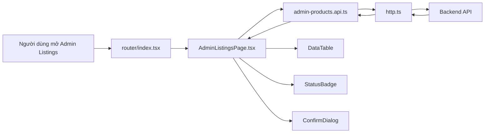

# Frontend Vietnamese Copy And Knowledge Capture Basics - 2026-03-17

## Mục tiêu

Ghi lại 2 vấn đề quan trọng cho FE:

1. Vì sao đôi khi chữ tiếng Việt lại bị mất dấu hoặc bị vỡ chữ.
2. Sau mỗi task FE, cần ghi lại kiến thức vào `docs/knowledge/` như thế nào để người mới cũng hiểu được.

## Phân biệt 2 lỗi rất dễ nhầm

### 1. Tiếng Việt không dấu

Ví dụ một câu tiếng Việt bị bỏ hết dấu, kiểu như câu `quản lý và kiểm duyệt các tin đăng bán xe` nhưng được viết thành dạng ASCII.

Đây **không phải** lỗi encoding. Đây thường là do người viết chủ động gõ ASCII để “an toàn”.

Trong case này, nguyên nhân thường là:

- trước đó người sửa code fallback sang kiểu chữ không dấu để tránh rủi ro encoding
- cách làm này an toàn về mặt kỹ thuật, nhưng xấu về mặt sản phẩm và không phù hợp cho UI tiếng Việt

### 2. Mojibake hoặc vỡ chữ

Ví dụ hay gặp:

- `Quản lý` đúng lại thành một chuỗi ký tự lạ
- `đã` bị biến thành các ký tự kiểu `Ã`, `Ä`, `Â`

Đây là lỗi **encoding** hoặc lỗi khi một file UTF-8 bị đọc bằng bộ mã sai.

Nói đơn giản:

- file đang dùng tiếng Việt đúng
- nhưng công cụ đọc file hiểu sai kiểu mã hóa
- kết quả là chữ bị biến thành ký tự lạ

## Encoding là gì?

`Encoding` là cách máy tính biến chữ thành số để lưu vào file.

Ví dụ rất dễ hiểu:

- con người thấy chữ `đ`
- máy tính phải biết `đ` được lưu thành chuỗi byte nào

Nếu lúc ghi file dùng một kiểu mã hóa, nhưng lúc đọc file lại dùng kiểu khác, chữ sẽ vỡ.

## UTF-8 là gì?

`UTF-8` là chuẩn mã hóa rất phổ biến hiện nay. Nó hỗ trợ tiếng Việt tốt.

Trong dự án FE này, nên xem `UTF-8` là chuẩn mặc định.

## Cách giảm tối đa việc bị mất dấu hoặc vỡ chữ

### 1. Với UI copy và tài liệu tiếng Việt, luôn dùng tiếng Việt có dấu

Ví dụ đúng:

- `Quản lý và kiểm duyệt các tin đăng bán xe`

Ví dụ không nên làm:

- biến cả câu thành dạng ASCII không dấu chỉ để “cho an toàn”

### 2. Giữ file ở UTF-8

Ta đã thêm [settings.json](/e:/Old_bicycle_system/old-bicycles-project/fe/.vscode/settings.json) để ưu tiên:

- `files.encoding = utf8`

Điều này không chữa được mọi lỗi cũ trên disk, nhưng giảm rất nhiều khả năng tạo thêm file lỗi mới.

### 3. Nếu file cũ đã vỡ chữ, đừng vá nửa chừng theo kiểu trộn lẫn

Nên chọn một trong 2 cách:

- chỉ sửa đúng block mình đang chạm nếu phần còn lại vẫn đọc được
- hoặc rewrite sạch cả file nếu file đã hỏng nặng

### 4. Đừng nhầm giữa lỗi terminal và lỗi file trên disk

Có lúc:

- mở file trong IDE vẫn đúng
- nhưng terminal in ra bị sai

Lúc đó chưa chắc file hỏng. Có thể terminal đang dùng code page không đúng.

## Vì sao AGENTS cần bổ sung rule này?

Vì nếu rule không nói rõ:

- model rất dễ quay về cách an toàn là dùng ASCII
- nhất là khi dự án đang có sẵn vài file lỗi encoding cũ

Nên FE AGENTS cần chốt:

- UI copy tiếng Việt phải giữ đúng dấu
- docs/handoff tiếng Việt cũng phải giữ đúng dấu
- chỉ code identifier và comment kỹ thuật mới nên giữ tiếng Anh

## Knowledge capture là gì?

`Knowledge capture` nghĩa là sau khi làm xong một task, ta không chỉ sửa code rồi thôi.

Ta còn phải ghi lại:

- mình đã làm gì
- khái niệm kỹ thuật nào liên quan
- luồng file đi ra sao
- request hoặc event chạy như thế nào
- người mới đọc lại có thể hiểu được không

Mục tiêu là:

- người trong nhóm đỡ hỏi lại từ đầu
- dev mới vào vẫn đọc hiểu được
- khi quên, chỉ cần mở note ra xem

## Knowledge note trong FE nên viết cho ai?

Mặc định nên viết cho:

- sinh viên năm nhất
- người mới học React
- người mới học tích hợp API

Điều đó có nghĩa là:

- câu văn ngắn, rõ
- có giải thích thuật ngữ
- có ví dụ cụ thể
- không nhảy cóc quá nhiều

## Những thuật ngữ FE cần giải thích dễ hiểu

### 1. Route

`Route` là đường dẫn trong app.

Ví dụ:

- `/admin/listings`
- `/messages`

Khi người dùng mở một đường dẫn, router sẽ chọn page tương ứng để hiển thị.

### 2. Page

`Page` là component lớn đại diện cho một màn hình.

Ví dụ:

- `AdminListingsPage.tsx`

### 3. Component

`Component` là mảnh giao diện nhỏ hơn page.

Ví dụ:

- `StatusBadge`
- `ConfirmDialog`
- `DataTable`

### 4. State

`State` là dữ liệu đang sống trong FE và có thể làm giao diện thay đổi.

Ví dụ:

- danh sách sản phẩm
- trạng thái loading
- thông báo lỗi

Khi state đổi, React thường sẽ render lại phần giao diện liên quan.

### 5. API module

`API module` là file gom các hàm gọi backend.

Ví dụ:

- `admin-products.api.ts`

Thay vì page tự gọi `axios`, page chỉ gọi hàm trong API module.

### 6. Rerender

`Rerender` là lúc React vẽ lại giao diện sau khi props hoặc state thay đổi.

### 7. Context

`Context` là cách chia sẻ dữ liệu cho nhiều component mà không phải truyền props qua quá nhiều tầng.

Ví dụ:

- `AuthContext`

## Luồng file của task dev: Admin Listings

Đây là luồng đi đơn giản, dễ nhớ:

1. Người dùng mở route admin listings.
2. Router chọn `AdminListingsPage.tsx`.
3. `AdminListingsPage` giữ state như:
   - `products`
   - `loading`
   - `error`
   - `page`
   - `statusFilter`
4. `useEffect` trong page gọi `adminProductsApi.getAll(...)`.
5. `adminProductsApi` dùng `http.ts` để gọi backend.
6. Backend trả dữ liệu danh sách sản phẩm.
7. FE cập nhật state `products`.
8. `DataTable` render danh sách.
9. `StatusBadge` render nhãn trạng thái.
10. Nếu người dùng bấm duyệt hoặc ẩn:
    - page mở `ConfirmDialog`
    - sau khi xác nhận, page gọi `adminProductsApi.approve(...)` hoặc `adminProductsApi.hide(...)`
    - request thành công thì page refetch danh sách

## Sơ đồ luồng đi

## Sau mỗi task FE nên ghi gì vào `docs/knowledge/`?

Ít nhất nên có 4 phần:

1. **Task này làm gì**
- Ví dụ: nối admin listings từ mock sang API thật

2. **Thuật ngữ quan trọng**
- Ví dụ: pagination, filter, API module, state

3. **Luồng file đi**
- route -> page -> component -> api -> backend -> state -> rerender

4. **Lưu ý khi người khác tích hợp tiếp**
- file nào là shared
- file nào không nên đụng
- state nào dễ làm hỏng UI

## Kết luận

Muốn trị dứt điểm việc tiếng Việt bị xấu trong FE, cần làm đồng thời 3 việc:

1. Chốt rule trong `AGENTS.md` rằng UI copy và docs tiếng Việt phải có dấu.
2. Giữ file ở UTF-8.
3. Sau mỗi task, viết note kiến thức rõ ràng để cả nhóm nhìn vào là hiểu luồng code đang đi thế nào.

Nếu chỉ sửa từng dòng chữ mà không sửa rule làm việc, lỗi này rất dễ quay lại.
