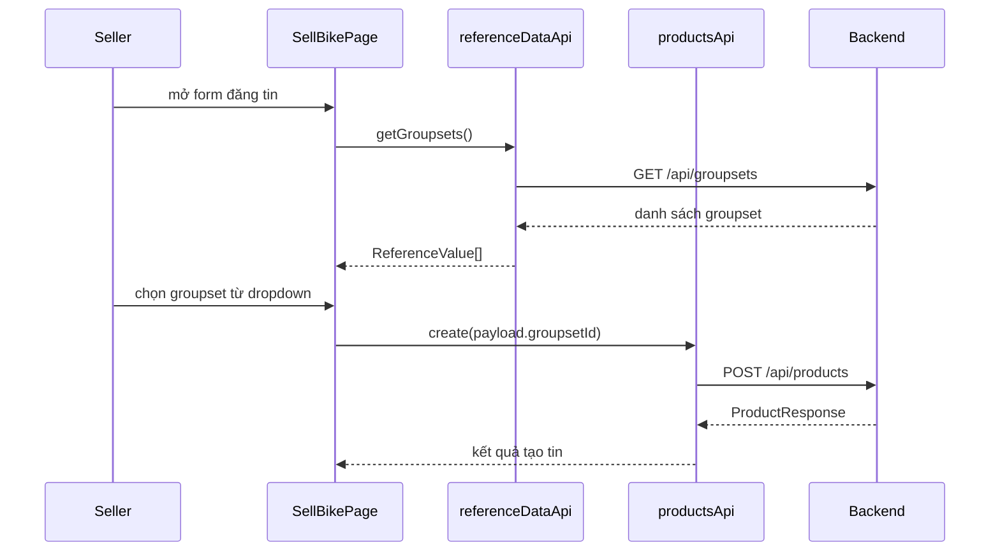
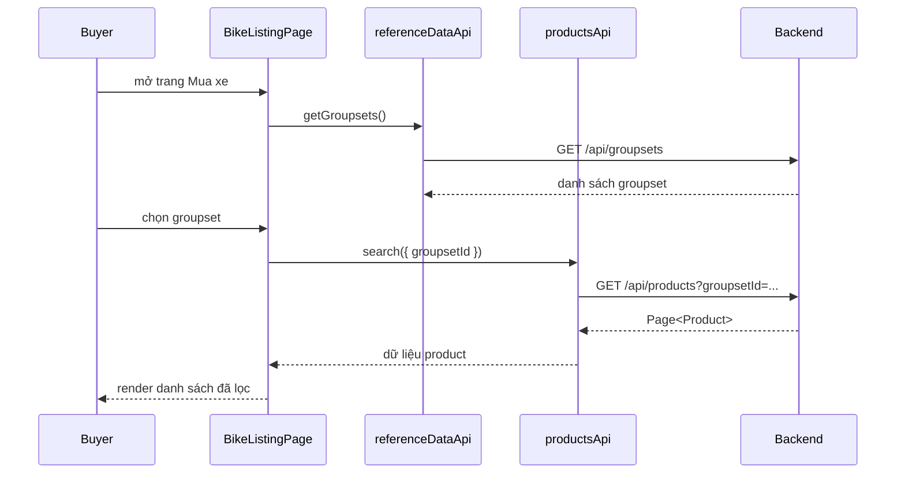

# Groupset Ở Frontend: admin quản lý, seller chọn, buyer lọc như thế nào?

## 1. Bối cảnh

Trước đây seller nhập `groupset` gần như tự do.

Điều đó dẫn tới các vấn đề:

- nhập sai chính tả
- cùng một groupset nhưng viết nhiều kiểu
- buyer lọc không ổn định
- admin không có chỗ quản lý danh sách groupset chuẩn

Lần này frontend được nối theo hướng:

- admin CRUD groupset
- seller chọn groupset từ danh sách
- buyer lọc marketplace theo groupset

## 2. Luồng frontend tổng thể

### Admin

- vào trang quản trị danh mục kỹ thuật
- mở tab `Groupset`
- thêm / sửa / xóa groupset

### Seller

- vào form đăng tin hoặc chỉnh sửa tin
- chọn `groupset` từ dropdown
- gửi `groupsetId` lên backend

### Buyer

- vào trang `Mua xe`
- chọn filter `Groupset`
- frontend gửi `groupsetId` lên API search

## 3. Các file chính

### API và type

- `src/api/reference-data.api.ts`
- `src/api/products.api.ts`
- `src/types/reference-data.ts`
- `src/types/product.ts`

### Admin

- `src/pages/admin/AdminCategoriesPage.tsx`

### Seller

- `src/pages/SellBikePage.tsx`
- `src/pages/seller/SellerEditProductPage.tsx`

### Buyer

- `src/pages/BikeListingPage.tsx`
- `src/pages/BikeDetailPage.tsx`

## 4. Luồng seller đăng tin với groupset

Điểm quan trọng:

- frontend gửi `groupsetId`
- không còn dựa vào việc seller gõ text tự do ở form

## 5. Luồng buyer lọc groupset ở marketplace

## 6. Vì sao FE vẫn giữ `product.groupset` trong response?

Vì buyer và seller vẫn cần một text dễ đọc để hiển thị.

Cho nên ở FE:

- `groupsetId` dùng cho filter và chọn giá trị chuẩn
- `groupset` dùng để render ra màn hình

Đây là lý do `Product` type hiện có cả:

- `groupsetId`
- `groupset`

## 7. Admin tab Groupset làm gì?

Trang:

- `AdminCategoriesPage.tsx`

thêm tab:

- `Groupset`

Tab này dùng chung pattern với:

- brake types
- frame materials

Tức là admin có thể:

- xem danh sách
- thêm mới
- sửa
- xóa

Frontend gọi các API:

- `GET /api/groupsets`
- `POST /api/admin/groupsets`
- `PUT /api/admin/groupsets/{id}`
- `DELETE /api/admin/groupsets/{id}`

## 8. Những điểm dễ hiểu nhầm

### Hiểu lầm 1: “FE chỉ cần hiển thị text groupset là đủ”

Không đủ.

Nếu chỉ hiển thị text:

- không có danh sách chuẩn
- filter buyer dễ sai
- dữ liệu seller nhập dễ loạn

### Hiểu lầm 2: “Seller chọn groupset rồi thì không cần `groupset` text nữa”

Chưa đúng ngay.

Trong giai đoạn chuyển tiếp:

- backend vẫn có dữ liệu cũ
- FE vẫn nên nhận `groupset` text để hiển thị ổn định

### Hiểu lầm 3: “Buyer filter groupset là logic hoàn toàn của FE”

Không đúng.

FE chỉ:

- giữ state filter
- gửi `groupsetId`

Còn backend mới là nơi quyết định query nào được áp vào database.

## 9. Chốt ngắn

Sau tranche này:

- admin có groupset master data
- seller chọn groupset từ danh sách chuẩn
- buyer lọc theo groupset ổn định hơn
- FE và BE cùng dùng chung khái niệm `groupsetId`

Đây là một ví dụ điển hình của việc frontend không chỉ “vẽ UI”, mà còn phải đi cùng:

- data model
- API contract
- business flow
