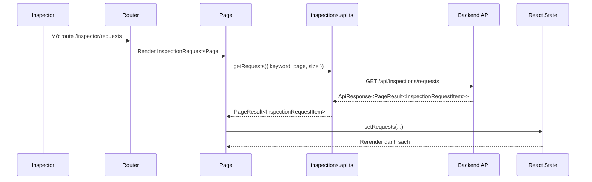

# Tích Hợp API Cho Khu Vực Inspector Ở Frontend - 2026-03-18

## Bối cảnh

Trước slice này, phần `inspector` ở frontend chưa thật sự nối với backend.

Một số màn hình mới chỉ là placeholder hoặc dữ liệu giả, nên người dùng chưa thể:

- xem dashboard thật
- xem danh sách xe đang chờ kiểm định
- xem lịch sử các lần kiểm định
- mở form kiểm định với dữ liệu thật của xe

Slice này nối các màn hình đó vào API backend thật.

## Một số khái niệm cần hiểu trước

### Page là gì?

`Page` là màn hình theo route.

Ví dụ:

- `/inspector/dashboard`
- `/inspector/requests`
- `/inspector/history`
- `/inspector/inspect/:id`

Mỗi page thường là nơi:

- gọi API
- giữ state chính
- render các block giao diện lớn

### State là gì?

`State` là dữ liệu đang được frontend giữ trong bộ nhớ để hiển thị ra màn hình.

Ví dụ trong inspector pages:

- `loading`
- `error`
- `requests`
- `historyItems`
- `dashboard`

Khi state đổi, React sẽ render lại giao diện.

### API module là gì?

`API module` là file gom các hàm gọi backend.

Trong slice này, file chính là:

- `src/api/inspections.api.ts`

Thay vì page tự viết URL nhiều lần, page chỉ gọi:

- `inspectionsApi.getDashboard()`
- `inspectionsApi.getRequests(...)`
- `inspectionsApi.getHistory(...)`
- `inspectionsApi.getByProduct(...)`
- `inspectionsApi.evaluate(...)`

### Rerender là gì?

`Rerender` là render lại giao diện sau khi state thay đổi.

Ví dụ:

1. page đang loading
2. API trả dữ liệu về
3. `setDashboard(result)`
4. React render lại, từ skeleton chuyển thành dữ liệu thật

## Các page inspector đã được nối API

### 1. `InspectorDashboardPage`

Page này gọi:

- `GET /api/inspections/dashboard`

Mục đích:

- lấy số liệu tổng quan cho inspector
- hiển thị thống kê
- hiển thị danh sách kiểm định gần đây

### 2. `InspectionRequestsPage`

Page này gọi:

- `GET /api/inspections/requests`

Mục đích:

- hiển thị hàng chờ kiểm định
- hỗ trợ tìm kiếm
- hỗ trợ phân trang
- cho inspector bấm sang form kiểm định

### 3. `InspectionHistoryPage`

Page này gọi:

- `GET /api/inspections/history`

Mục đích:

- xem lại các xe đã kiểm định
- xem điểm, kết quả đạt hay không đạt, thời gian đánh giá

### 4. `InspectionFormPage`

Page này gọi:

- `GET /api/products/{id}`
- `GET /api/inspections/product/{id}`
- `POST /api/inspections/evaluate/{id}`

Mục đích:

- tải bối cảnh thật của xe
- hiển thị dữ liệu cũ nếu đã có inspection
- cho inspector chấm điểm và gửi kết quả

## Luồng đi ở frontend

### Sơ đồ tổng quát



## Giải thích luồng theo kiểu từng bước

### Ví dụ 1: Màn danh sách yêu cầu kiểm định

1. Người dùng mở route `/inspector/requests`
2. Router render `InspectionRequestsPage`
3. `useEffect` chạy sau lần render đầu tiên
4. Page gọi `inspectionsApi.getRequests(...)`
5. API module gửi request tới backend
6. Backend trả về `ApiResponse<PageResult<InspectionRequestItem>>`
7. API module unwrap phần `result`
8. Page gọi `setRequests(...)`, `setTotalPages(...)`
9. React rerender và hiện dữ liệu thật

### Ví dụ 2: Màn form kiểm định

1. Người dùng bấm `Bắt đầu kiểm định`
2. Router chuyển sang `/inspector/inspect/:id`
3. `InspectionFormPage` lấy `id` từ `useParams()`
4. Page gọi song song:
   - `productsApi.getById(id)`
   - `inspectionsApi.getByProduct(id)`
5. Dữ liệu trả về được map vào state:
   - `product`
   - `inspection`
   - `scores`
   - `wearPercentage`
   - `notes`
6. Khi inspector bấm `Đạt chuẩn` hoặc `Không đạt`, page gọi:
   - `inspectionsApi.evaluate(id, payload)`
7. Thành công thì điều hướng sang `/inspector/history`

## Vì sao phải tách `types/inspection.ts`?

Trong frontend, type giúp mình biết chính xác dữ liệu backend trả về có shape như thế nào.

Slice này bổ sung thêm type:

- `InspectionRequestItem`
- `InspectionHistoryItem`
- `InspectionDashboard`
- `InspectionListFilters`

Điều này giúp:

- tránh đoán field bằng cảm tính
- IDE gợi ý đúng
- đỡ lỗi khi đổi API

## Flow file trong project này

Đây là luồng file thực tế khi user mở một màn inspector:

1. `router/index.tsx`
2. page tương ứng trong `src/pages/inspector/`
3. page gọi `src/api/inspections.api.ts`
4. API module gọi `src/lib/http.ts`
5. backend trả về `ApiResponse<T>`
6. API module unwrap `result`
7. page set state
8. UI render lại

## Những lỗi dễ gặp

### 1. Gọi API trực tiếp trong nhiều file khác nhau

Nếu mỗi page tự viết URL bằng tay, code sẽ:

- lặp
- khó sửa
- dễ lệch contract

Nên gom vào `inspections.api.ts`.

### 2. Không tách `loading` và `error`

Nếu không có `loading`/`error`, user sẽ không biết:

- đang tải hay đang lỗi
- trang trắng là do chưa có data hay do request hỏng

### 3. Dùng text tiếng Việt bị vỡ dấu

Khi file FE có text bị sai encoding, người dùng sẽ thấy UI rất xấu và khó hiểu.

Trong slice này, các page inspector đã được rewrite sạch sang UTF-8 chuẩn để tránh lặp lại lỗi đó.

## Ví dụ nhỏ

Nếu backend trả:

```json
{
  "code": 1000,
  "result": {
    "pendingRequests": 3,
    "completedThisWeek": 2,
    "passRate": 75.0,
    "averageScore": 4.4,
    "recentInspections": []
  }
}
```

thì frontend sẽ:

- bỏ qua lớp `code`
- lấy `result`
- đưa vào state `dashboard`
- render 4 thẻ thống kê

## Kết luận

Slice inspector ở frontend hiện đã đi từ mức "placeholder" lên mức "page thật có data thật".

Nói ngắn gọn:

- router đã có đường vào
- page đã gọi API thật
- type đã được tách rõ
- form đánh giá dùng dữ liệu thật
- UI inspector có loading, error, pagination và điều hướng hợp lý
