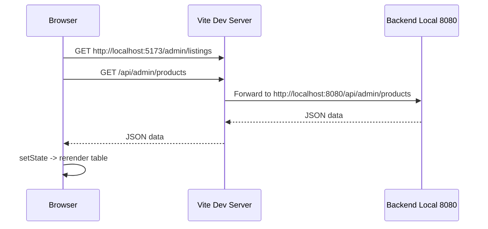

# Local Dev Proxy Và Vì Sao Dữ Liệu Tải Chậm: giải thích cho người mới học

## 1. Bối cảnh

Trong lúc chạy FE local bằng:

- `npm run dev`

trang web mở ở:

- `http://localhost:5173`

Nhưng điều đó **không có nghĩa** FE đang gọi thẳng backend local.

Trong project này, FE dùng `Vite proxy`.

`Proxy` có thể hiểu đơn giản là:

- FE gửi request vào server dev của Vite
- rồi Vite chuyển tiếp request đó sang backend thật

## 2. Vấn đề đã gặp

Trước khi sửa, file:

- `vite.config.ts`

đang cấu hình:

- `/api`
- `/ws`

đều proxy sang:

- một URL `ngrok`

Nghĩa là khi bạn đang phát triển local:

1. browser gọi `localhost:5173`
2. Vite nhận request
3. Vite đẩy request ra Internet qua `ngrok`
4. `ngrok` mới chuyển tiếp về backend

Luồng này dài hơn rất nhiều so với:

1. browser gọi `localhost:5173`
2. Vite chuyển tiếp thẳng tới `localhost:8080`

## 3. Vì sao điều này làm mọi thứ trông chậm?

Vì mỗi request phải đi qua thêm một vòng mạng.

Điều đó đặc biệt dễ thấy ở:

- trang list dữ liệu
- chat
- các màn dashboard có nhiều request cùng lúc

Ví dụ trang chat có thể cần:

- lấy danh sách conversation
- lấy messages
- mark as read
- mở WebSocket

Nếu mỗi bước đều đi qua `ngrok`, độ trễ sẽ cộng dồn.

## 4. Những nguyên nhân khác cũng góp phần làm chậm

Không chỉ có `ngrok`.

### FE hiện tại dùng fetch sau khi mount

Nhiều page đang có pattern:

1. render khung rỗng
2. `useEffect(...)` chạy
3. mới gọi API
4. chờ response xong mới set state

Điều này tạo cảm giác:

- vào trang xong phải đợi vài giây mới thấy dữ liệu

### Chat đang có nhiều bước liên tiếp

Ở chat:

- load conversation list
- load message history
- mark as read
- connect STOMP/WebSocket
- còn có fallback refetch định kỳ

Nên chat luôn nhạy với latency hơn page thường.

### Backend list hiện còn có chỗ dễ phát sinh nhiều query

Ví dụ:

- list product admin
- list conversation

có thể gặp kiểu `N+1 query`.

`N+1 query` nghĩa đơn giản là:

- lấy danh sách chính 1 lần
- rồi với mỗi item lại query thêm 1 hoặc vài lần nữa

Nếu danh sách dài, backend sẽ chậm hơn.

## 5. Bản sửa lần này là gì?

Tôi đã đổi `vite.config.ts` theo hướng:

- mặc định dev local dùng:
  - `http://localhost:8080`
- nếu cần demo qua tunnel thì mới set:
  - `VITE_DEV_PROXY_TARGET=https://...ngrok...`

Nghĩa là:

- local dev nhanh hơn
- public demo vẫn làm được khi cần

## 6. Luồng FE sau khi sửa

Nếu dùng `ngrok`, luồng sẽ dài hơn:

- Browser
- Vite
- Internet
- ngrok
- backend

## 7. Áp dụng thực tế cho project này

### Khi phát triển hằng ngày

Nên để:

- backend local ở `localhost:8080`
- FE local ở `localhost:5173`
- proxy local -> local

### Khi muốn demo public

Mới đổi sang:

- `VITE_DEV_PROXY_TARGET=https://<your-ngrok-domain>`

## 8. Những hiểu lầm dễ gặp

### Hiểu lầm 1: “Mở localhost là chắc chắn mọi thứ đều local”

Không đúng.

Browser có thể mở local FE, nhưng FE vẫn proxy request tới backend ở nơi khác.

### Hiểu lầm 2: “Chậm là do frontend render nặng”

Không hẳn.

Trong case này, phần lớn cảm giác chậm đến từ:

- fetch sau mount
- nhiều request nối tiếp
- proxy qua `ngrok`

### Hiểu lầm 3: “Chỉ cần sửa FE là hết chậm”

Không đúng hoàn toàn.

Muốn mượt hơn nữa thì còn phải tối ưu:

- backend query
- API list
- cách FE cache và reuse data

## 9. Chốt ngắn

Lý do lớn nhất khiến project này “trông rất chậm” trong local dev là:

- FE đang tải dữ liệu sau khi mount
- một số màn gọi nhiều request
- và trước khi sửa, dev proxy còn đi qua `ngrok`

Bản sửa lần này không giải quyết hết mọi nguyên nhân, nhưng nó bỏ đi một nút thắt rất lớn:

- local FE giờ nên gọi local backend trực tiếp

Đây là bước nền quan trọng trước khi tối ưu sâu hơn các list và chat.
