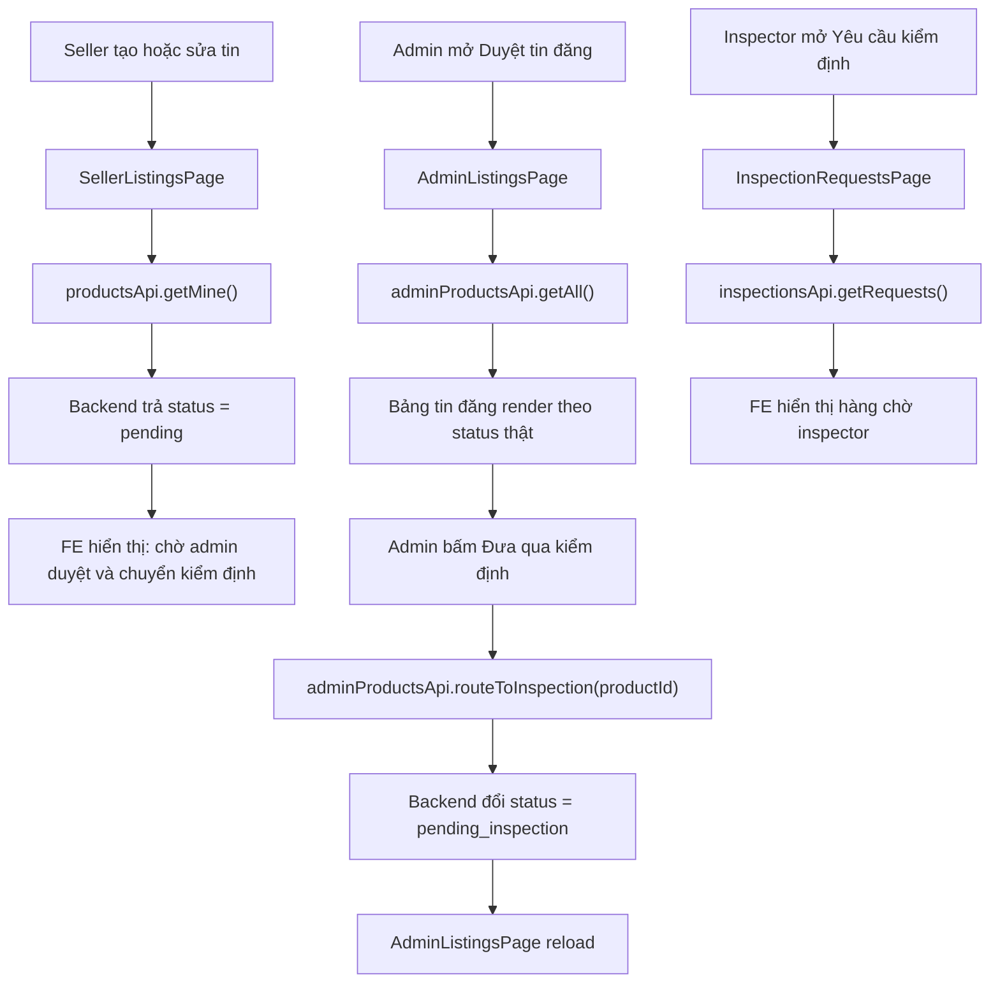

# FE flow bắt buộc kiểm định trước khi public: giải thích cho người mới học

## 1. Bối cảnh của thay đổi

Backend đã đổi nghiệp vụ:

- admin không được đưa tin lên public trực tiếp
- admin phải chuyển tin qua inspection
- seller không còn tự bấm gửi inspection
- chỉ khi inspection đạt thì tin mới public

Điều này buộc frontend phải đổi theo. Nếu FE vẫn giữ UI cũ thì sẽ có các vấn đề:

- admin thấy nút duyệt thẳng ra public
- seller thấy nút tự gửi kiểm định
- copy trên màn hình nói sai so với business rule thật
- tester dễ hiểu nhầm flow

## 2. Những file FE chính bị ảnh hưởng

- `src/pages/admin/AdminListingsPage.tsx`
- `src/pages/seller/SellerListingsPage.tsx`
- `src/pages/inspector/InspectionRequestsPage.tsx`
- `src/api/admin-products.api.ts`

## 3. Luồng FE mới hoạt động như thế nào?

## 4. Giải thích theo kiểu runtime của FE

### 4.1 Seller side

Người dùng seller vào:

- `SellerListingsPage`

Trang này gọi:

- `productsApi.getMine(page, size)`

Sau khi backend trả dữ liệu về, React sẽ:

- cập nhật `state`
- render lại giao diện

Vì flow mới đã đổi, seller không còn thấy nút:

- tự yêu cầu inspection

Thay vào đó seller chỉ thấy:

- trạng thái của tin
- gợi ý text giải thích trạng thái đó có nghĩa gì

Ví dụ:

- `pending`: chờ admin xem và chuyển sang inspection
- `pending_inspection`: inspector đang xử lý
- `inspected_failed`: cần sửa rồi chờ admin chuyển kiểm định lại

### 4.2 Admin side

Admin vào:

- `AdminListingsPage`

Trang này gọi:

- `adminProductsApi.getAll(...)`

Khi admin mở menu thao tác cho một tin phù hợp, action chính bây giờ là:

- `Đưa qua kiểm định`

FE sẽ gọi:

- `adminProductsApi.routeToInspection(productId)`

Sau khi request thành công:

- dialog đóng lại
- page tăng `refreshKey`
- `useEffect` chạy lại
- bảng reload dữ liệu mới

### 4.3 Inspector side

Inspector vào:

- `InspectionRequestsPage`

Trang này gọi:

- `inspectionsApi.getRequests({ keyword, page, size })`

Nếu backend trả về danh sách:

- FE render từng card inspection request

Nếu chưa có request:

- FE render empty state riêng

## 5. Vì sao phải sửa cả UI text?

Nhiều bạn mới học thường chỉ nghĩ:

> “API chạy là được.”

Nhưng FE không chỉ là gọi API. FE còn phải nói đúng chuyện đang diễn ra.

Nếu backend đã đổi nghiệp vụ mà text trên màn hình vẫn là:

- “duyệt tin”
- “gửi kiểm định”
- “public ngay”

thì người dùng sẽ hiểu sai.

Cho nên lần này cần sửa cả:

- action label
- status label
- mô tả page
- hint text
- test expectation

## 6. Vì sao phải sửa test FE theo copy mới?

Test FE không chỉ kiểm tra logic.

Nó còn kiểm tra:

- trang có render text đúng không
- nút đúng tên không
- link đúng route không

Ví dụ:

- `InspectionRequestsPage.test.tsx`
- `AdminListingsPage.test.tsx`

nếu vẫn assert text cũ thì test sẽ fail, dù page chạy đúng.

Đó là lý do test phải được cập nhật cùng lúc với UI.

## 7. Điều quan trọng về data flow

Trong slice này, FE **không tự quyết định business rule**.

FE chỉ:

- gọi API
- hiển thị đúng state
- ẩn những action không còn hợp lệ

Business rule thật vẫn nằm ở backend.

Điều này rất quan trọng vì:

- FE có thể bị sửa, bị bypass, hoặc bị gọi API bằng tool khác
- backend mới là nơi chốt xem action nào được phép

## 8. Những hiểu nhầm dễ gặp

### Hiểu nhầm 1: FE có thể tự “cho lên public”

Không.

FE chỉ gọi API. Backend mới quyết định có cho đổi trạng thái hay không.

### Hiểu nhầm 2: Seller không thấy nút inspection nghĩa là inspection bị mất

Không đúng.

Inspection vẫn tồn tại, chỉ là quyền route sang inspection đã chuyển cho admin.

### Hiểu nhầm 3: Chỉ cần sửa `api.ts`

Không đủ.

Một thay đổi nghiệp vụ như thế này chạm vào:

- page
- action menu
- empty state
- copy
- regression test

## 9. Chốt ngắn

Slice FE này làm cho giao diện nói đúng với flow mới:

- seller tạo tin
- admin chuyển qua inspection
- inspector xử lý
- đạt thì mới public

Nói cách khác:

Frontend không còn “kể sai câu chuyện” của backend nữa.
