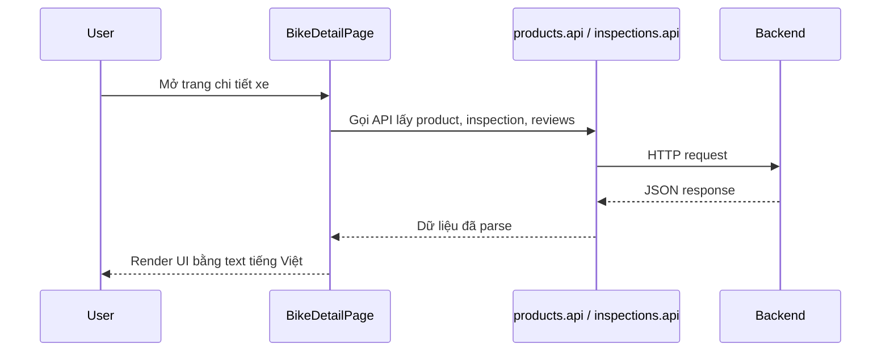

# Dọn mojibake ở trang chi tiết xe

## Bối cảnh

Trang chi tiết xe là nơi tập trung rất nhiều chữ người dùng nhìn thấy:

- mô tả
- thông số kỹ thuật
- báo cáo kiểm định
- đánh giá
- nút thao tác mua hàng

Khi file này bị mojibake, trải nghiệm sẽ hỏng ngay vì nhiều label và message quan trọng bị vỡ dấu.

File được dọn trong lần này là:

- `src/pages/BikeDetailPage.tsx`

## Mojibake trong frontend là gì?

Đây là trường hợp text trong source code React đã bị lưu sai mã hóa, nên lúc build lên trình duyệt sẽ hiện chữ lỗi.

Ví dụ:

- Đúng: `Không tìm thấy sản phẩm`
- Sai: `Không tìm thấy sản phẩm`

## Vì sao phải dọn theo block hoặc cả file?

Nếu một file vừa có text UTF-8 đúng, vừa có text mojibake, lần sửa sau rất dễ:

- copy nhầm chuỗi lỗi
- tạo thêm UI mới nhưng vẫn lẫn lỗi cũ
- khó search vì file nửa đúng nửa sai

Vì vậy rule thực dụng là:

- nếu chỉ một đoạn nhỏ lỗi, sửa sạch đoạn đó
- nếu file bị nhiều chỗ, rewrite sạch toàn bộ block đang chạm

## Lần này đã sửa gì?

Các nhóm text được dọn gồm:

- trạng thái tình trạng xe
- loading và error message
- phần mô tả, thông số kỹ thuật
- section size chart
- section báo cáo kiểm định
- section đánh giá
- modal tạo yêu cầu mua

Ngoài việc sửa dấu tiếng Việt, lần này còn dọn luôn:

- placeholder ảnh khi chưa có ảnh
- câu hướng dẫn ở modal mua xe
- các label liên quan đến inspection và size chart

## Luồng FE của trang này

Nếu text tĩnh trong `BikeDetailPage.tsx` bị lỗi, thì dù dữ liệu API đúng, người dùng vẫn thấy UI bị vỡ dấu.

## Cách kiểm tra sau khi sửa

1. search các pattern mojibake như `Ã`, `Đ`, `á»`
2. chạy `npm run build`
3. mở lại bike detail và xem:
   - thông số kỹ thuật
   - báo cáo kiểm định
   - size chart
   - modal tạo yêu cầu mua

## Kinh nghiệm rút ra

- File UI lớn, nhiều text người dùng nhìn thấy, nên kiểm tra encoding thường xuyên.
- Khi text tiếng Việt bị vỡ, phải sửa ngay trước khi tiếp tục polish UI.
- Giữ toàn bộ copy ở UTF-8 chuẩn sẽ giúp những lượt chỉnh UX sau an toàn hơn nhiều.
