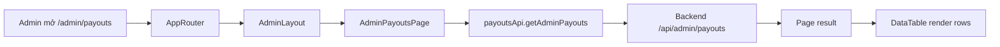

# Payout Profile Và Màn Admin Giải Ngân Ở Frontend

## 1. Bối cảnh

Sau khi backend thêm `manual VietQR payout`, frontend cần có 2 màn mới:

- màn để buyer hoặc seller khai tài khoản nhận tiền
- màn để admin xem danh sách payout và xác nhận đã chuyển khoản

Nếu không có 2 màn này, backend có API nhưng người dùng rất khó sử dụng.

## 2. Thuật ngữ cần hiểu

### `Payout profile`

Đây là thông tin tài khoản ngân hàng của người nhận tiền.

Frontend cho người dùng nhập:

- tên ngân hàng
- mã BIN ngân hàng
- số tài khoản
- tên chủ tài khoản

### `Payout`

Đây là một khoản tiền hệ thống cần trả ra ngoài.

Ví dụ:

- hoàn tiền cho buyer
- giải ngân tiền cọc cho seller

### `Admin payout page`

Đây là trang admin dùng để:

- xem danh sách payout
- mở QR VietQR
- xem nội dung chuyển khoản
- nhập `bankRef`
- đánh dấu đã chuyển tiền thật

## 3. File nào tham gia vào luồng này?

### Phần người dùng

- `src/pages/ProfilePage.tsx`
- `src/components/profile/PayoutProfileSection.tsx`
- `src/api/payouts.api.ts`
- `src/types/payout.ts`

### Phần admin

- `src/pages/admin/AdminPayoutsPage.tsx`
- `src/constants/routes.ts`
- `src/router/index.tsx`
- `src/components/dashboard/Sidebar.tsx`

### Phần trạng thái order

- `src/types/order.ts`
- `src/lib/order-display.ts`

## 4. Luồng 1: người dùng cập nhật payout profile

```mermaid
flowchart LR
    A[User mở /profile?tab=payout] --> B[ProfilePage]
    B --> C[PayoutProfileSection]
    C --> D[payoutsApi.getMyProfile]
    D --> E[Backend /api/payout-profiles/me]
    E --> F[Response profile hoặc null]
    F --> G[React state cập nhật]
    G --> H[Form render lại]

    H --> I[User bấm Lưu payout profile]
    I --> J[payoutsApi.upsertMyProfile]
    J --> K[Backend PUT /api/payout-profiles/me]
    K --> L[Response profile mới]
    L --> M[State success + rerender]
```



### Giải thích đơn giản

1. User vào trang hồ sơ.
2. `ProfilePage` đọc query `tab=payout`.
3. Nếu đang ở tab `payout`, component `PayoutProfileSection` được render.
4. Component gọi API để lấy thông tin cũ.
5. Khi user sửa và bấm lưu, component gọi API `PUT`.
6. Nếu thành công, UI hiện thông báo đã lưu xong.

## 5. Luồng 2: admin xem danh sách payout



### Những gì admin thấy trên trang

- loại payout
- người nhận
- order hoặc refund liên quan
- số tiền
- trạng thái
- dialog chi tiết có QR VietQR

## 6. Luồng 3: admin hoàn tất payout

1. Admin mở dialog chi tiết hoặc thao tác từ menu dòng.
2. Admin nhập `bankRef`.
3. `AdminPayoutsPage` gọi:

```ts
payoutsApi.completeAdminPayout(payoutId, {
  bankReference,
  adminNote,
})
```

4. Backend trả payout mới.
5. Trang gọi lại danh sách payout và render trạng thái mới.

## 7. Vì sao phải thêm tab `Nhận tiền` vào `ProfilePage`?

Nếu chỉ có admin page mà không có nơi để user khai tài khoản ngân hàng, sẽ có vấn đề:

- refund được duyệt nhưng buyer chưa có tài khoản nhận tiền
- seller hoàn tất đơn nhưng chưa có tài khoản nhận payout

Tab `Nhận tiền` giải quyết đúng chỗ này.

Nó giúp:

- buyer tự chuẩn bị tài khoản nhận hoàn tiền
- seller tự chuẩn bị tài khoản nhận giải ngân

## 8. Vì sao phải sửa `order-display.ts`?

Frontend trước đó chỉ hiểu các trạng thái cũ như:

- `held`
- `released`
- `refunded`

Sau bản sửa backend, có thêm:

- `seller_payout_pending`
- `refund_pending_transfer`

Nếu frontend không hiểu 2 trạng thái này thì:

- UI sẽ hiển thị sai
- người dùng sẽ tưởng tiền đã chuyển xong dù thực tế chưa

Nên `order-display.ts` được cập nhật để mapping đúng text:

- chờ giải ngân cho người bán
- chờ chuyển khoản hoàn tiền

## 9. Một ví dụ rất thực tế

### Case buyer refund

1. Buyer gửi yêu cầu hoàn tiền.
2. Admin duyệt.
3. Backend tạo payout.
4. Buyer mở tab `Nhận tiền` và điền tài khoản ngân hàng nếu còn thiếu.
5. Admin vào `/admin/payouts`.
6. Admin dùng VietQR để chuyển khoản thủ công.
7. Admin nhập `bankRef`.
8. UI admin cập nhật trạng thái payout thành hoàn tất.

## 10. Những hiểu lầm dễ gặp

### Hiểu lầm 1: “Profile page chỉ dành cho buyer”

Không đúng.

Trong bản sửa này:

- buyer có thể cần tài khoản nhận refund
- seller có thể cần tài khoản nhận payout

Nên tab `Nhận tiền` có ích cho cả hai nhóm.

### Hiểu lầm 2: “Admin chỉ cần nhìn order là đủ”

Không đúng.

Order chỉ nói trạng thái nghiệp vụ.

Trang `AdminPayoutsPage` mới là nơi admin theo dõi lần chuyển khoản thủ công thật.

### Hiểu lầm 3: “Có QR là xong payout”

Không đúng.

QR chỉ là hướng dẫn chuyển khoản.
Sau khi chuyển thật, admin vẫn phải nhập `bankRef`.

## 11. Chốt ngắn

Ở frontend, bản sửa này thêm một luồng hoàn chỉnh:

- user có chỗ khai tài khoản nhận tiền
- admin có chỗ theo dõi payout
- UI hiểu đúng các trạng thái payout mới

Điều đó làm cho `manual VietQR payout` không còn là API rời rạc, mà thành một flow dùng được từ đầu đến cuối.
