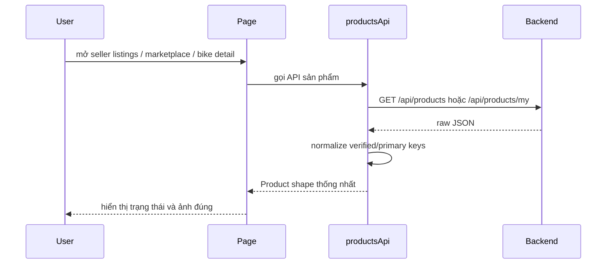

# Product API boolean normalization basics - 2026-03-25

## 1. Vấn đề

Frontend có type:

```ts
type Product = {
  isVerified: boolean
  images: { isPrimary: boolean }[]
}
```

Nhưng backend thực tế có thể trả:

```json
{
  "verified": true,
  "images": [
    { "primary": true }
  ]
}
```

Khi đó UI đọc:

- `product.isVerified`
- `image.isPrimary`

thì cả hai giá trị đều có thể thành `undefined`.

## 2. Normalization là gì?

Normalization là bước "chuẩn hóa dữ liệu" ngay sau khi nhận response API.

Nó giúp frontend biến nhiều dạng dữ liệu đầu vào về đúng shape mà ứng dụng đang dùng.

Ví dụ:

```ts
const normalized = {
  isVerified: raw.isVerified ?? raw.verified ?? false,
}
```

## 3. Đã áp dụng trong project này như thế nào

Ở `src/api/products.api.ts`, frontend thêm hàm:

- `normalizeProductImage()`
- `normalizeProduct()`
- `normalizeProductPage()`

Các hàm này chuyển:

- `verified -> isVerified`
- `primary -> isPrimary`

rồi mới trả dữ liệu cho page/component dùng tiếp.

## 4. Luồng FE sau khi sửa



## 5. Vì sao seller page báo sai trước đó

Seller page dùng helper:

```ts
if ((product.status === 'active' || product.status === 'inspected_passed') && !product.isVerified) {
  // báo chưa đủ điều kiện public
}
```

Nếu `product.isVerified` bị `undefined`, điều kiện `!product.isVerified` sẽ thành `true`.

Vì vậy UI kết luận sai rằng sản phẩm chưa đủ điều kiện public.

## 6. Vì sao marketplace chung vẫn thấy xe

Marketplace public không dựa vào helper này để quyết định có hiện sản phẩm hay không.

Quyền hiển thị public được backend lọc trước ở API.

Nghĩa là:

- backend quyết định xe có được public hay không
- seller page trước đây chỉ hiển thị sai label vì đọc nhầm key JSON

## 7. Bài học

Khi FE consume API từ Java/Spring Boot:

- đừng tin hoàn toàn vào tên field boolean nếu backend dùng `isXxx`
- nên normalize ở lớp API client
- và thêm test nhỏ để khóa contract này

Trong task này, test mới đã kiểm tra:

- `verified` được map sang `isVerified`
- `primary` được map sang `isPrimary`
