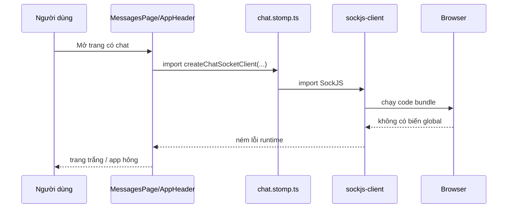
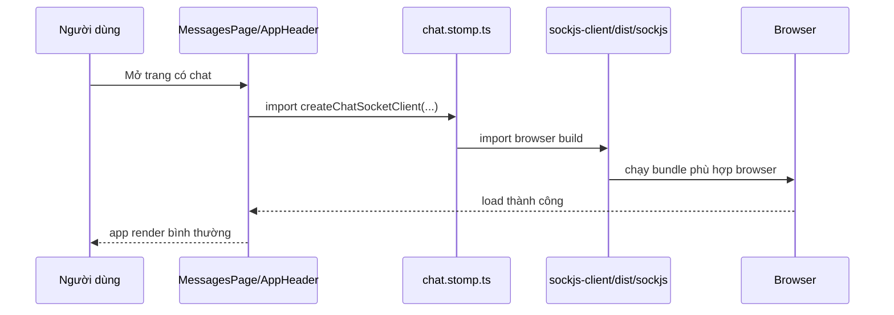

# Lỗi `global is not defined` Khi Dùng SockJS Với Vite - 2026-03-18

## Bối cảnh

Trong lúc mở FE ở môi trường local, app bị trắng trang và console báo lỗi:

```text
Uncaught ReferenceError: global is not defined
```

Lỗi xuất hiện khi code chat realtime import thư viện `sockjs-client`.

Các file liên quan trực tiếp trong dự án:

- [chat.stomp.ts](/e:/Old_bicycle_system/old-bicycles-project/fe/src/sockets/chat.stomp.ts)
- [chat.stomp.test.ts](/e:/Old_bicycle_system/old-bicycles-project/fe/src/sockets/chat.stomp.test.ts)
- [sockjs-browser.d.ts](/e:/Old_bicycle_system/old-bicycles-project/fe/src/types/sockjs-browser.d.ts)

## `global` là gì?

`global` là một biến quen thuộc trong môi trường Node.js.

Ví dụ rất đơn giản:

- Trong trình duyệt, object toàn cục thường là `window`
- Trong môi trường JavaScript hiện đại, object toàn cục chuẩn là `globalThis`
- Trong Node.js cũ, nhiều thư viện quen dùng `global`

Vấn đề là app FE của mình chạy trong **browser** thông qua **Vite**. Browser không tự có biến `global` theo kiểu mà một số thư viện cũ mong đợi.

## Vì sao lỗi này xảy ra?

Thư viện `sockjs-client` có nhiều cách build khác nhau.

Khi import như sau:

```ts
import SockJS from 'sockjs-client'
```

Vite có thể kéo vào một build cũ của thư viện. Build đó dùng `global` ở bên trong. Khi code chạy trong browser, `global` không tồn tại, nên app nổ ngay lúc load module.

Nói đơn giản:

1. FE mở trang
2. Component chat hoặc header import `chat.stomp.ts`
3. `chat.stomp.ts` import `sockjs-client`
4. Bundle cũ của `sockjs-client` đòi biến `global`
5. Browser không có `global`
6. Trang trắng và app dừng từ rất sớm

## Cách sửa đã áp dụng

Thay vì import từ entry mặc định của package, dự án chuyển sang import browser build rõ ràng hơn:

```ts
import SockJS from 'sockjs-client/dist/sockjs'
```

Đây là bản build phù hợp hơn cho môi trường browser/Vite.

Sau đó thêm một file khai báo type:

```ts
declare module 'sockjs-client/dist/sockjs' {
  import SockJS from 'sockjs-client'

  export default SockJS
}
```

File này giúp TypeScript hiểu module mới vừa import là hợp lệ.

## Luồng file trong FE cho lỗi này



Sau khi sửa:



## Vì sao không sửa bằng cách thêm `global = globalThis`?

Đó là một cách vá nhanh, nhưng không phải cách sạch nhất.

Nếu mình thêm polyfill kiểu:

```ts
window.global = window
```

thì mình đang sửa cả môi trường chạy để chiều theo một dependency cũ.

Điều đó có 2 rủi ro:

1. Vá quá rộng, ảnh hưởng nhiều chỗ không cần thiết
2. Sau này khó biết thư viện nào thực sự đang không tương thích

Vì vậy ở task này, cách tốt hơn là:

- chọn đúng browser build của thư viện
- giữ phạm vi sửa nhỏ

## Cách kiểm tra sau khi sửa

Đã kiểm tra bằng:

```bash
npm run test:run -- src/sockets/chat.stomp.test.ts
npm run build
```

Kết quả:

- test pass
- build pass
- lỗi `global is not defined` không còn là blocker của app nữa

## Điều cần nhớ cho người mới học

Khi gặp lỗi kiểu:

- `global is not defined`
- `process is not defined`
- `Buffer is not defined`

thì thường đó là dấu hiệu:

- code frontend đang vô tình dùng một package thiên về Node.js
- hoặc đang import nhầm build không phù hợp cho browser

Thứ tự kiểm tra nên là:

1. Xem file import nào gây lỗi
2. Xem package đó có browser build riêng không
3. Chỉ polyfill môi trường nếu thật sự không còn cách sạch hơn

## Áp dụng cụ thể trong dự án này

Task chat realtime đang đi qua các file:

1. Người dùng mở header hoặc trang chat
2. [AppHeader.tsx](/e:/Old_bicycle_system/old-bicycles-project/fe/src/layouts/AppHeader.tsx) hoặc [ChatWindow.tsx](/e:/Old_bicycle_system/old-bicycles-project/fe/src/components/messages/ChatWindow.tsx) gọi socket client
3. [chat.stomp.ts](/e:/Old_bicycle_system/old-bicycles-project/fe/src/sockets/chat.stomp.ts) tạo kết nối STOMP
4. SockJS mở kết nối đến backend `/ws`
5. Backend gửi sự kiện chat realtime
6. FE cập nhật state và render lại UI

Nếu bước 3 import sai build của SockJS, toàn bộ flow realtime sẽ hỏng ngay từ đầu.

## Hiểu nhầm dễ gặp

### Hiểu nhầm 1: "Lỗi này là do backend WebSocket"

Không đúng.

Backend có thể vẫn chạy bình thường. Lỗi này nổ ngay trong browser lúc FE load module.

### Hiểu nhầm 2: "Chỉ cần refresh trang là hết"

Không đúng.

Đây là lỗi code/runtime, không phải lỗi mạng tạm thời.

### Hiểu nhầm 3: "TypeScript không báo lỗi thì runtime chắc chắn ổn"

Không đúng.

TypeScript chủ yếu kiểm tra kiểu dữ liệu. Nó không đảm bảo rằng build của dependency đang phù hợp với browser.
