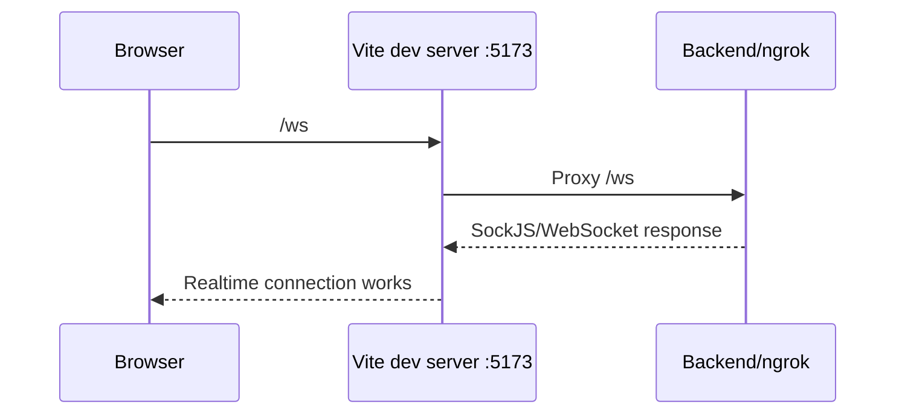

# Vite `/ws` Proxy, Notice Tạo Đơn, Và Product Lock Ở FE - 2026-03-18

## Bối cảnh

Có 3 vấn đề người dùng nhìn thấy:

1. Chat realtime báo mất kết nối và console spam `404 /ws/...`
2. Buyer tạo đơn chuyển khoản xong không thấy QR ngay
3. Một số xe đang có giao dịch vẫn nhìn giống như còn bán bình thường

## 1. Vì sao chat bị `404 /ws/...`?

### WebSocket là gì?

WebSocket là cách để frontend và backend giữ một kết nối mở lâu hơn HTTP thông thường.

Nó phù hợp cho chat vì:

- backend có thể đẩy tin nhắn mới ngay
- frontend không phải gọi API liên tục để hỏi “có tin nhắn mới chưa?”

### Lỗi ở đây là gì?

Frontend chạy ở:

- `http://localhost:5173`

Chat client dùng SockJS để mở kết nối tới:

- `/ws`

Nhưng Vite dev server trước đó chỉ proxy:

- `/api`

chứ chưa proxy:

- `/ws`

Kết quả là request realtime bị gửi vào chính Vite dev server thay vì backend, nên trả về `404`.

## 2. Sửa như thế nào?

Đã thêm proxy `/ws` trong:

- [vite.config.ts](/e:/Old_bicycle_system/old-bicycles-project/fe/vite.config.ts)

Sau khi sửa, luồng local dev là:

### Lưu ý quan trọng

Sau khi đổi `vite.config.ts`, bạn phải:

1. dừng `npm run dev`
2. chạy lại `npm run dev`

Vì proxy của Vite không tự đổi giữa chừng nếu dev server cũ vẫn đang chạy.

## 3. Vì sao tạo đơn xong chưa có QR ngay?

Đây là business flow của backend, không phải bug ngẫu nhiên.

Luồng đúng hiện tại là:

1. Buyer ở trang chi tiết xe bấm tạo đơn.
2. Backend tạo order với trạng thái `pending`.
3. Buyer được đưa sang trang `Đơn mua`.
4. Seller phải chấp nhận đơn trước.
5. Chỉ sau khi seller chấp nhận, buyer mới có thể bấm lấy thông tin thanh toán.
6. Lúc đó backend mới trả QR hoặc hướng dẫn chuyển khoản.

## 4. FE đã sửa UX chỗ này như thế nào?

Trước đây FE chỉ redirect sang trang orders, nên người dùng dễ hiểu lầm là app “quên” hiện QR.

Bây giờ FE:

- vẫn redirect sang trang `Đơn mua`
- nhưng kèm một notice giải thích:
  - đơn đã được tạo
  - cần chờ người bán chấp nhận
  - sau đó mới lấy QR/thông tin chuyển khoản

Các file liên quan:

- [BikeDetailPage.tsx](/e:/Old_bicycle_system/old-bicycles-project/fe/src/pages/BikeDetailPage.tsx)
- [BuyerOrdersView.tsx](/e:/Old_bicycle_system/old-bicycles-project/fe/src/components/profile/BuyerOrdersView.tsx)

## 5. Product lock ở FE là gì?

Backend mới trả thêm field:

- `lockedForTransaction`

Ý nghĩa:

> xe này đang có giao dịch mở, nên FE không nên cho buyer khác tạo thêm đơn mua

Frontend dùng field này để:

1. hiển thị banner cảnh báo ở trang chi tiết
2. disable nút tạo đơn mua

## Luồng file trong FE

### A. Luồng chat realtime

1. User mở trang chat
2. [chat.stomp.ts](/e:/Old_bicycle_system/old-bicycles-project/fe/src/sockets/chat.stomp.ts) tạo SockJS client
3. Browser gọi `/ws`
4. [vite.config.ts](/e:/Old_bicycle_system/old-bicycles-project/fe/vite.config.ts) proxy sang backend
5. Backend trả event realtime
6. FE nhận event rồi render lại component chat

### B. Luồng tạo đơn mua

1. User bấm `Tạo yêu cầu mua` ở [BikeDetailPage.tsx](/e:/Old_bicycle_system/old-bicycles-project/fe/src/pages/BikeDetailPage.tsx)
2. Page gọi [orders.api.ts](/e:/Old_bicycle_system/old-bicycles-project/fe/src/api/orders.api.ts)
3. Backend tạo order
4. FE `navigate()` sang profile tab orders và gửi theo `state.orderCreatedNotice`
5. [BuyerOrdersView.tsx](/e:/Old_bicycle_system/old-bicycles-project/fe/src/components/profile/BuyerOrdersView.tsx) đọc notice đó
6. Component hiển thị message giải thích cho user

### C. Luồng khóa xe đang có giao dịch

1. FE gọi [products.api.ts](/e:/Old_bicycle_system/old-bicycles-project/fe/src/api/products.api.ts)
2. Backend trả về `Product`
3. [product.ts](/e:/Old_bicycle_system/old-bicycles-project/fe/src/types/product.ts) có field `lockedForTransaction`
4. [BikeDetailPage.tsx](/e:/Old_bicycle_system/old-bicycles-project/fe/src/pages/BikeDetailPage.tsx) dùng field này để:
   - hiện cảnh báo
   - khóa nút tạo đơn

## Thuật ngữ cần nhớ

### Proxy

Proxy là “trạm trung gian”.

Ở đây Vite nhận request từ browser rồi chuyển tiếp sang backend.

### Redirect

Redirect ở FE là đổi route sang trang khác, ví dụ từ `BikeDetailPage` sang `ProfilePage`.

### Route state

`route state` là dữ liệu nhỏ FE gửi kèm khi `navigate()`.

Nó hữu ích khi bạn muốn:

- chuyển trang
- nhưng vẫn mang theo một message ngắn như notice thành công

### Disable button

Disable button nghĩa là nút vẫn hiện ra, nhưng không cho bấm.

Trong UX, cách này tốt hơn việc “biến mất” hoàn toàn, vì người dùng còn thấy có tính năng đó, chỉ là đang tạm không dùng được.

## Hiểu lầm dễ gặp

### Hiểu lầm 1: “Tạo đơn xong là phải có QR ngay”

Không đúng với flow hiện tại.

QR chỉ có sau khi seller chấp nhận đơn.

### Hiểu lầm 2: “Xe còn `status = active` nghĩa là FE phải cho mua tiếp”

Không đúng nữa.

Sau fix này, FE phải nhìn cả:

- `status`
- và `lockedForTransaction`

### Hiểu lầm 3: “Sửa mỗi chat client là đủ cho lỗi realtime”

Không đủ.

Nếu Vite dev server không proxy `/ws`, chat client vẫn có thể gọi sai đích và nhận `404`.
